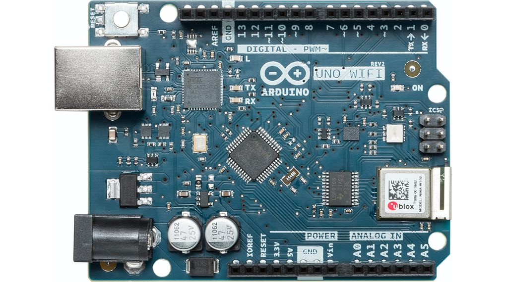
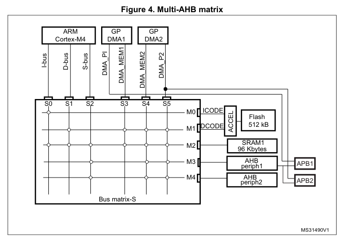
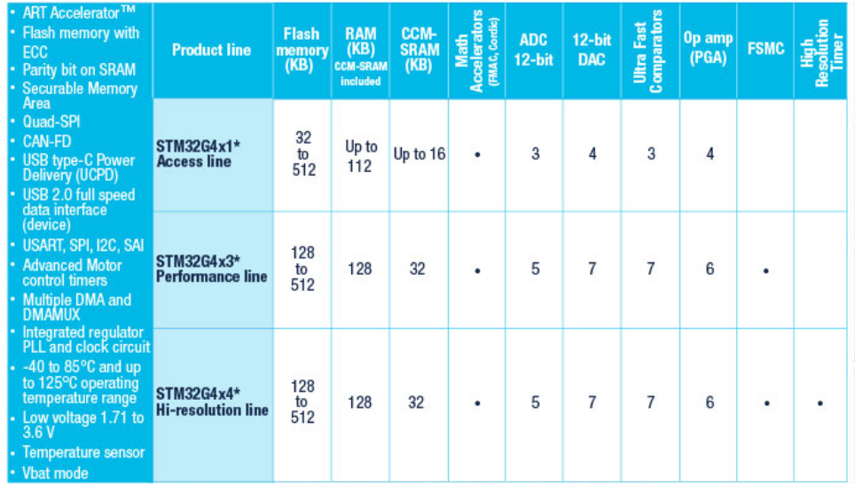
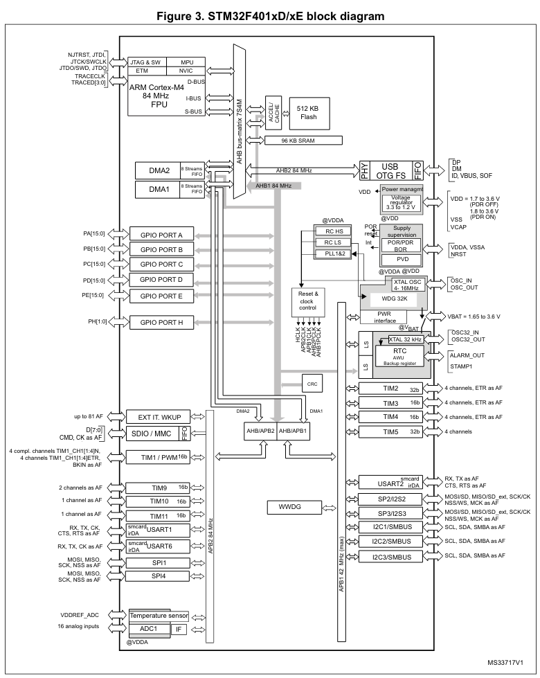
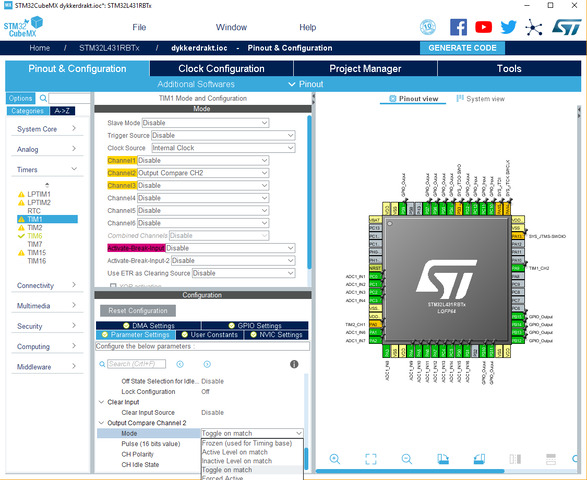

<!--
author:   Sebastian Zug, Karl Fessel & Andrè Dietrich
email:    sebastian.zug@informatik.tu-freiberg.de

version:  1.0.5
language: de
narrator: Deutsch Female

import:  https://raw.githubusercontent.com/liascript-templates/plantUML/master/README.md
         https://github.com/LiaTemplates/AVR8js/main/README.md
         https://github.com/LiaTemplates/Pyodide

icon: https://upload.wikimedia.org/wikipedia/commons/d/de/Logo_TU_Bergakademie_Freiberg.svg

-->


[](https://liascript.github.io/course/?https://github.com/TUBAF-IfI-LiaScript/VL_DigitaleSysteme/main/lectures/11_CortexMController.md#1)


# ARM Cortex M Controller

| Parameter                | Kursinformationen                                                                                                                                                                    |
| ------------------------ | ------------------------------------------------------------------------------------------------------------------------------------------------------------------------------------ |
| **Veranstaltung:**       | `Vorlesung Softwareentwicklung für eingebettete Systeme`                                                                                                                                                      |
| **Semester**             | `Sommersemester 2024`                                                                                                                                                                |
| **Hochschule:**          | `Technische Universität Freiberg`                                                                                                                                                    |
| **Inhalte:**             | `Cortex M Controller Features`                                                                                            |
| **Link auf den GitHub:** | [https://github.com/TUBAF-IfI-LiaScript/VL_DigitaleSysteme/blob/main/lectures/11_CortexMController.md](https://github.com/TUBAF-IfI-LiaScript/VL_DigitaleSysteme/blob/main/lectures/11_CortexMController.md) |
| **Autoren**              | @author                                                                                                                                                                              |


---

## Rückblick

<!--data-type="none"-->
| Arduino Uno Board                                                                                                 | Arduino Uno Wifi Rev. 2    | Nucleo 64                                                                                          |
| ----------------------------------------------------------------------------------------------------------------- | --- | -------------------------------------------------------------------------------------------------- |
| <!-- style="width: 100%; auto; max-width: 415px;" --> |  <!-- style="width: 100%; auto; max-width: 415px;" -->   | <!-- style="width: 100%; max-width=315px;" --> |
| Microchip ATmega 328p                                                                                             | Microchip ATmega 4809    | STM32F401                                                                                          |
| 8-Bit AVR Familie                                                                                                 |   8-Bit AVR Familie     | 32-Bit Cortex M4 Prozessor                                                                         |
| Assembler, C, C++                                                                                                       | Assembler, C, C++    | Assembler, C, C++, MicroPython, ...                                                                                              |
| avrlibc, FreeRTOS                                                                                                 | avrlibc, FreeRTOS      | CMSIS, mbedOS, FreeRTOS                                                                            |
| 10 Bit Analog-Digital-Wandler, 16 Bit Timer,                                                                      | 10 Bit Analog-Digital-Wandler, 16 Bit Timer, Eventsystem, programmierbare Logik, priorisierbare Interrupts      | 10 timers, 16- and 32-bit (84 MHz), 12-bit ADC                                                     |


## Was ist eigentlich ein ARM Prozessor?

ARM - Advanced Risc Maschines

| Jahr    | Architektur | Familie                              |
| ------- | ----------- | ------------------------------------ |
| 1985    | ARMv1       | ARM1                                 |
| 1986    | ARMv2       | ARM2, ARM3                           |
| 1995    | ARMv4       | ARM7TDMI, ARM8, StrongARM,  ARM9TDMI |
| 2002    | ARMv5       | ARM7EJ, ARM9E, ARM10E                |
| 2002    | ARMv6       | ARM11, Arm Cortex-M (M0, M0+, M1)    |
| ab 2004 | ARMv7       | Arm Cortex-A, M, R                   |
| ab 2012 | ARMv8       | Arm Cortex-A, M7, R                  |
| 2021    | ARMv9       | Arm Cortex-A, Arm Neoverse           |

Die Architektur von ARM-Prozessoren erfuhr seit 1985 zahlreiche Veränderungen, zum Beispiel bei der Zahl der Register, der Größe des Adressraumes und dem Umfang des Befehlsatzes. Sie wird daher in Versionen unterteilt, abgekürzt mit ARMv[Versionsnummer]. Beginnend mit ARMv2, wurden die Architekturversionen in mehr als nur einem Prozessordesign implementiert.

> In Bezug auf das Instruktionsset werden verschiedene Befehlssätze implementiert - Thumb, Thumb-2, ARM32 und ARM64.

Ab der Armv7-Architektur werden die sie implementierenden Prozessorkerne drei Anwendungsfeldern zugeteilt:

+ Arm Cortex-A: Der Buchstabe A steht für die Bezeichnung englisch Application (dt. betriebssystembasierte Anwendungen). Diese Prozessorfamilien erreichen durch vielstufige Pipelines und mehrstufige Caches hohe Performance.
+ Arm Cortex-M: Der Buchstabe M steht für die Bezeichnung englisch Microcontroller (dt. Mikrocontrolleranwendungen). Typische Anwendung in nicht zeitkritischen steuer- und regeltechnischen Aufgaben. Cortex-M Mikrocontroller sind von vielen Herstellern verfügbar und zeichnen sich durch ein umfangreiches Angebot an Ein- und Ausgabeschnittstellen aus.
+ Arm Cortex-R: Der Buchstabe R steht für die Bezeichnung englisch Realtime (dt. Echtzeitsystem). Diese für harte Echtzeitanforderungen geeigneten Prozessoren finden sich unter anderem als Controller in Festplatten und Solid-State-Drives und in sicherheitskritischen Anwendungen, wie beispielsweise in Fahrzeugen als Teil der Steuereinheit von Antiblockiersystemen oder in der Auslöseelektronik von Airbags.

ARM entwickelt das Design von RISC-Prozessoren, deren Fertigung von den Lizenznehmern durchgeführt wird, zu denen die Firmen AMD, Apple, Microchip, Freescale, HiSilicon, IBM, Infineon, Intel, MediaTek, Nvidia, NXP, Qualcomm, Renesas, Samsung, Texas Instruments, ... gehören.

## Cortex M Prozessoren

Die Prozessoren Cortex-M0 und M1 basieren auf einer ARMv6-M Architektur, die Cortex-M3 auf einer Armv7-M Architektur, und die Cortex-M4 sowie Cortex-M7 auf einer Armv7E-M Architektur. Die Unterschiede betreffen primär den Befehlssatz und die zur Verfügung stehenden Maschinenbefehle. Die Linien sind so festgelegt, dass die binären Maschinenbefehle aufwärts kompatibel sind, das heißt, ein Maschinenprogramm von einem Cortex-M0 oder M1 ist ohne Veränderung auch auf einem Cortex-M3, M4 oder M7 lauffähig.

Alle Prozessoren aus der Cortex-M-Familie unterstützen die Basisbefehle aus dem so genannten Thumb-Befehlssatz, dem Thumb-2-Befehlssatz, und bieten zusätzlich eine Multipliziereinheit in Hardware. M0 und M1 fehlen allerdings im Thumb-Befehlssatz neuere Erweiterungen. Die Einschränkungen bei M0 und M1 sind Folge der Vorgabe, die Chipfläche möglichst klein zu halten.

Cortex-M3, mit größerer Chipfläche, umfasst den vollständigen Thumb- und Thumb-2-Befehlssatz, bietet darüber hinaus einige spezielle Instruktionen, eine eigene Divisionseinheit in Hardware und kann mathematische Befehle wie Addition statt mit Überlauf auch mit Sättigung behandeln, was insbesondere im Bereich der Signalverarbeitung von Bedeutung ist. Cortex-M4 erweitert diese Möglichkeiten um einige spezielle Befehle, wie sie bei digitalen Signalprozessoren (DSP) üblich sind, und bietet optional eine Gleitkommaeinheit für die Bearbeitung von Gleitkommazahlen nach der Norm IEEE 754 für einfache Genauigkeit.Der Cortex-M7 erweitert die Gleitkommaeinheit für die Bearbeitung von Gleitkommazahlen für doppelte Genauigkeit.

<!-- data-type="none" -->
| ARM        | Thumb        | Thumb-2     | Hardware Multiplizierer | Hardwaredividierer | DSP--Erweiterung | Sättigungsarithmetik | Gleitkommaeinheit | TrustZone | ARM-Architektur      |
| ---------- | ------------ | ----------- | ----------------------- | ------------------ | ---------------- | -------------------- | ----------------- | --------- | -------------------- |
| Cortex-M0  | Größtenteils | Teilmenge   | 1 oder 32 Zyklen        | nein               | nein             | nein                 | nein              | nein      | ARMv6-M[9]           |
| Cortex-M1  | Größtenteils | Teilmenge   | 3 oder 32 Zyklen        | nein               | nein             | nein                 | nein              | nein      | ARMv6-M[9]           |
| Cortex-M3  | Vollständig  | Vollständig | 1 Zyklus                | ja                 | nein             | teilweise            | nein              | nein      | Armv7-M[10]          |
| Cortex-M4  | Vollständig  | Vollständig | 1 Zyklus                | ja                 | ja               | ja                   | Optional          | nein      | Armv7E-M[10]         |
| Cortex-M7  | Vollständig  | Vollständig | 1 Zyklus                | ja                 | ja               | ja                   | Optional          | nein      | Armv7E-M[10]         |
| Cortex-M23 | Vollständig  | Vollständig | 1 oder 32 Zyklen        | ja                 | nein             | nein                 | nein              | ja        | Armv8-M Baseline[12] |
| Cortex-M33 | Vollständig  | Vollständig | 1 Zyklus                | ja                 | ja               | ja                   | Optional          | ja        | Armv8-M[12]          |

```ascii
+-----------------------------------------+
|+---------------------------------------+|                                  
|| +------------------------------------+||                               
|| | +---------------------+            |||                 
|| | | Cortex M0, M0+, M1  |            |||                 
|| | | ARMv6               |            |||                 
|| | +---------------------+            |||                 
|| |   Cortex M3                        |||       
|| |   ARMv7                            |||                            
|| |   Erweiterte Datenverarbeitung     |||                                                      
|| |   Bit Operationen                  |||                                          
|| |   Multiplikations/Addtionseinheit  |||                                                         
|| +------------------------------------+||                                                              
||     Cortex-M4                         ||              
||     Digitaler Signal Prozessor        ||          
||     optionale FPU Einheit             ||                                             
|+---------------------------------------+|                                                               
|      Cortex-M7F                         |  
|      Erweiterter Signalprozessor        |      
|      optionale FPU Einheit              |                                            
+-----------------------------------------+                                    .
```

## Architekturelemente

Erweiterte Elemente der Architektur:

+ Memory Protection Unit (MPU) - Die MPU überwacht Transaktionen, einschließlich Befehlsabrufe und Datenzugriffe des Prozessors, die eine Fehlerausnahme auslösen können, wenn eine Zugriffsverletzung festgestellt wird. Der Hauptzweck des Speicherschutzes besteht darin, einen Prozess daran zu hindern, auf Speicher zuzugreifen, der ihm nicht zugewiesen wurde.
+ Floating Point Unit (FPU)  - Eine Fließkommaeinheit ist ein Teil eines Computersystems, der speziell für die Durchführung von Operationen mit Fließkommazahlen ausgelegt ist. Typische Operationen sind Addition, Subtraktion, Multiplikation, Division und Quadratwurzel.
+ Direct memory access (DMA) - Direkter Speicherzugriff (DMA) ist eine Funktion von Computersystemen, die es bestimmten Hardware-Subsystemen ermöglicht, unabhängig von der Zentraleinheit (CPU) auf den Hauptsystemspeicher (Random-Access Memory) zuzugreifen. Ohne DMA ist die CPU bei einer programmierten Ein-/Ausgabe typischerweise für die gesamte Dauer des Lese- oder Schreibvorgangs voll ausgelastet und steht somit für andere Arbeiten nicht zur Verfügung. Mit DMA initiiert die CPU zuerst die Übertragung, dann führt sie andere Operationen aus, während die Übertragung läuft, und schließlich erhält sie einen Interrupt vom DMA-Controller (DMAC), wenn die Operation abgeschlossen ist.
+ System Timer (SysTick-Timer) - Für die Triggerung eines Betriebssystems stellt jeder Cortex M Kern einen separaten Timer bereit, der den Wechsel zwischen Tasks steuert. Ohne OS kann der System Timer aber auch frei verwendet werden.

Zudem werden die erweiterten Componenten durch ein mehrteiliges Bussystem verknüpft:

| Bus                  | Bedeutung       |
| -------------------- | --------------- |
| I-Bus                | Instruction Bus |
| D-Bus                | Datenbus        |
| S-Bus                | System Bus      |
| DMA Bus Verbindungen |                 |
| USB On-the-go        |                 |

Diese Bus Ausgänge des Core werden auf unterschiedliche Busse im Controller abgebildet.



[^STM32]: Firma ST, STM32F401xx Controller Data Sheet, [Link](https://www.st.com/resource/en/reference_manual/dm00096844-stm32f401xbc-and-stm32f401xde-advanced-armbased-32bit-mcus-stmicroelectronics.pdf)

## Hersteller

Unter anderem bieten folgende Halbleiterhersteller Cortex-M4 basierende Mikrocontroller an:

+ Atmel: SAM4-Familie (Cortex-M4)
+ Freescale: Kinetis-Familie (Cortex-M4 und Cortex-M4F)
+ Infineon: XMC4000-Familie (Cortex-M4F)
+ NXP: LPC40xx- und LPC43xx-Familien (Cortex-M4)
+ STMicroelectronics: STM32-F4, L4-, F3-, G4-Familien (Cortex-M4F)
+ Texas Instruments: Stellaris-LM4F- und Tiva-TM4C-Familie (Cortex-M4F)
+ Toshiba: TX04-Familie (Cortex-M4F)
+ ...

Um das Bezeichnungsgewirr komplett zu machen, führen die Hersteller, hier STMicroelectronics (STM), dann noch eigene Bezeichnungen ein:

| STM32 Series           | ARM CPU Core |
| ---------------------- | ------------ |
| L5                     | Cortex-M33F  |
| F7, H7                 | Cortex-M7F   |
| F3, F4, G4, L4, L4+, J | Cortex-M4F   |
| F1, F2, L1, W, J       | Cortex-M3    |
| G0, L0, J              | Cortex-M0+   |
| F0, J                  | Cortex-M0    |


## Microchip STM32F

Die STM32 F4-Serie ist die erste Gruppe von STM32-Mikrocontrollern, die auf dem ARM Cortex-M4F-Kern basieren und über DSP- und Fließkomma-Befehle verfügt. Die F4-Serie ist Pin-zu-Pin-kompatibel mit der STM32 F2-Serie und bietet zusätzlich eine höhere Taktrate, 512 KB Flash Memory, bis zu 96 Kbytes SRAM, Full-Duplex I2S, eine Echtzeituhr und schnellere ADCs. Die Betriebsspannungsbereich beträgt 1,8 bis 3,6 Volt.





[^STM32]: Firma ST, STM32F401xx Controller Data Sheet, [Link](https://www.st.com/resource/en/reference_manual/dm00096844-stm32f401xbc-and-stm32f401xde-advanced-armbased-32bit-mcus-stmicroelectronics.pdf)

[^STM32]: Firma ST, STM32F401xx Controller Data Sheet, [Link](https://www.st.com/resource/en/reference_manual/dm00096844-stm32f401xbc-and-stm32f401xde-advanced-armbased-32bit-mcus-stmicroelectronics.pdf)

## Programmierung

**ARM Cortex Microcontroller Software Interface Standard **

Die CMSIS  ist eine Library von ARM für den Zugriff auf die herstellerübergreifenden Funktionen des ARM-Cores. Hierzu gehört bei den Cortex-M4F-Cores auch die DSP und Floating-Point Funktionalität.

```ascii

      +--------------------------------------------------------------------+       
      |                        Application Code                            |                  
      +--------------------------------------------------------------------+        
            |           |      |             |                    |                
            |           | +--------+  +------------+              |               
            |           | |  RTOS  |  | Middleware |              |               
            |           | | Kernel |  | Components |              |               
            |           | +--------+  +------------+              |               
            |           |      |             |                    |
            |           v      v             v                    v            
      +-----|---+--------------------------------------+--------------------+                           
CMSIS |     |   | Core Peripheral | Middleware Access  |  Device Peripheral |
      |     |   |    Functions    |    Functions       |       Functions    |                     
      |     v   +-----------------+--------------------+--------------------+       
      |   Peripheral Register & Interrupt Vector Definitions                |                  
      +---------------------------------------------------------------------+                    
            |             |           |            |               |
            v             v           v            v               v
      +---------+  +------------+  +------+  +-------------+  +-------------+                        
MCU   | Cortex  |  | SysTick    |  | NVIC |  | Debug/Trace |  | other       |                      
      |  CPU    |  | RTOS Timer |  |      |  |  Interface  |  | Peripherals |                    
      +---------+  +------------+  +------+  +-------------+  +-------------+                       
```

Im Rahmen der CMSIS-Implementierung wurden die Headerdateien standardisiert, der Zugriff auf die Register erfolgt per Peripheral->Register. Die CMSIS C-Dateien bzw. Header enthalten auch Anpassungen für die verschiedenen Compiler. Die Portierung eines Real-Time-Betriebsystems sollte unter Verwendung der CMSIS, für Chips der verschiedenen Hersteller, stark vereinfacht möglich sein (z.B. einheitliche Adressen für Core-Hardware/Sys-Tick-Counter).

```c
#include "cmsis_os.h"                           // CMSIS RTOS header file

osThreadId thread1_id;

void job1 (void const *argument)  {             // thread function 'job1'
  while (1)  {
    //...                                       // execute some code
    osDelay (10);                               // delay execution for 10ms
  }
}
// define job1 as thread function
osThreadDef(job1, osPriorityAboveNormal, 1, 0);
int main (void)
{
  // ...
  thread1_id = osThreadCreate(osThread(job1), NULL);
  //...
}
```

> Die Dokumentation der aktuellen CMSIS findet sich unter anderem unter [Link](https://www.keil.com/pack/doc/cmsis/RTOS/html/group__CMSIS__RTOS__ThreadMgmt.html)

!?[alt-text](https://www.youtube.com/watch?v=ttXW58-drYw)

**HAL**

Der STM32CubeMX, ein grafisches Software-Konfigurationswerkzeug, das die Generierung von C-Initialisierungscode mithilfe grafischer Assistenten ermöglicht. Der STM32Cube Hardware Abstraction Layer (HAL), eine STM32 Abstraktionsschicht für eingebettete Software, die maximale Portabilität über den STM32 Mikrocontroller hinweg gewährleistet. Der HAL ist für die gesamte Hardware-Peripherie verfügbar.

")



Die Low-Layer-APIs (LL) bieten eine expertenorientierte Schicht, die näher an der Hardware ist als der HAL. Die LL-APIs sind nur für eine Reihe von Peripheriegeräten verfügbar.

HAL und LL sind komplementär und decken ein breites Spektrum von Anwendungsanforderungen ab:

+ Die HAL bietet High-Level- und funktionsorientierte APIs mit einem hohen Portabilitätsniveau. Sie verbergen die Komplexität der MCU und der Peripherie für den Endanwender.
+ Die LL bietet Low-Level-APIs auf Registerebene, mit besserer Optimierung, aber weniger Portabilität. Sie erfordern tiefe Kenntnisse der MCU- und Peripheriespezifikationen.

Der Quellcode der HAL- und LL-Treiber ist in ANSI-C entwickelt, was ihn unabhängig von den Entwicklungswerkzeugen macht.

**Alternative Framesworks**

+ Standard-Peripherie-Bibliothek (veraltet) - Die ST Standard Peripheral Library bietet eine Reihe von Funktionen für den Umgang mit der Peripherie auf den Mikrocontrollern der STM32 Familie.

+ libopencm3 - Das libOpenCM3-Framework zielt darauf ab, eine freie und quelloffene Firmware-Bibliothek für verschiedene ARM Cortex-M0(+)/M3/M4-Mikrocontroller zu erstellen.

+ Zephyr RTOS - Das Zephyr-Projekt ist ein skalierbares Echtzeit-Betriebssystem (RTOS), das mehrere Hardware-Architekturen unterstützt, für ressourcenbeschränkte Geräte optimiert ist und mit Blick auf Sicherheit und Schutz entwickelt wurde.

+ Mbed OS - Arm Mbed OS ist ein Open-Source-Embedded-Betriebssystem, es enthält alle Funktionen, die Sie für die Entwicklung eines vernetzten Produkts auf Basis eines Arm Cortex-M-Mikrocontrollers benötigen, einschließlich Sicherheit, Konnektivität, einem RTOS und Treibern für Sensoren und E/A-Geräte.

## Beispiele


[Usermanual des Boards](https://usermanual.wiki/Pdf/UM1724UserManualSTM32Nucleo64boards.913537569/view)

| Index | Basis der Umsetzung | Weiterführende Links                                                                       |
| ----- | ------------------- | ------------------------------------------------------------------------------------------ |
| 1     | CMSIS               | [ARM CMSIS](https://developer.arm.com/tools-and-software/embedded/cmsis)                   |
| 2     | HAL                 | [STM HAL Tutorials](http://stm32f4-discovery.net/2014/09/stm32f4-tutorials-one-place/)     |
| 3     | HAL mit STM32CubeMX |                                                                                            |
| 4     | mbed                | [mbedOS Einführung](https://os.mbed.com/docs/mbed-os/v6.12/introduction/architecture.html) |

!?[](https://www.youtube.com/watch?v=eumKLXNlM0U)

")
