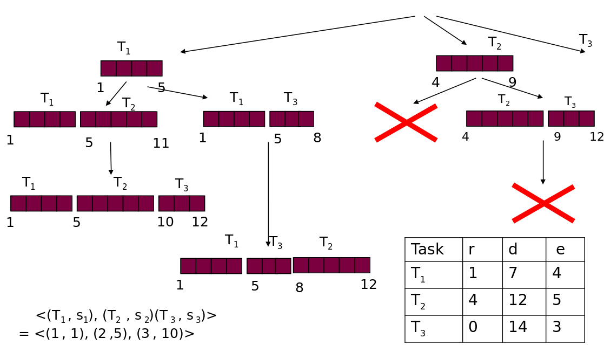
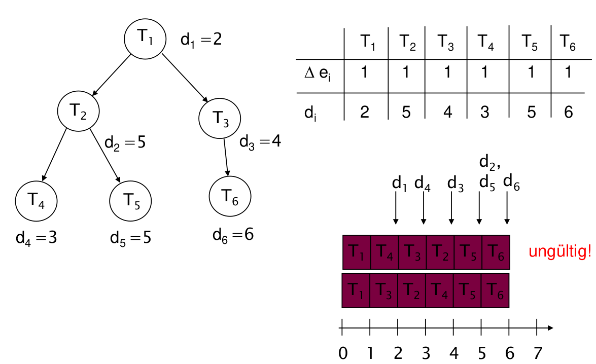
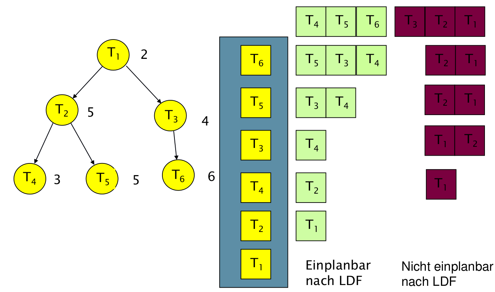
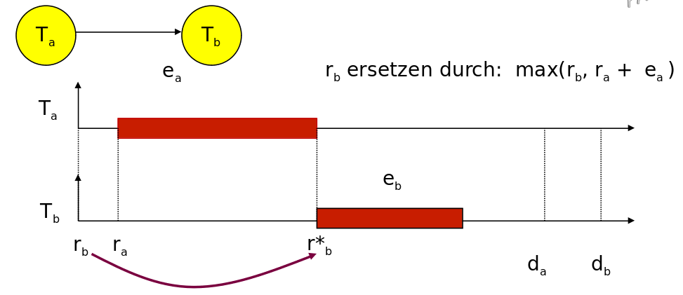
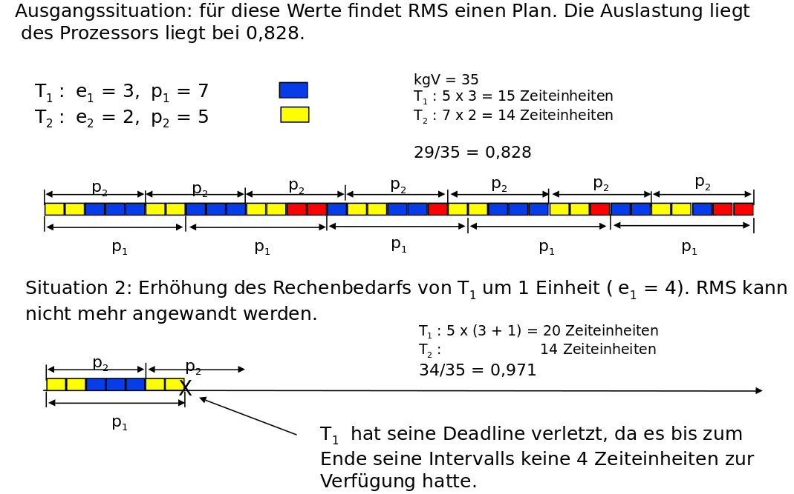
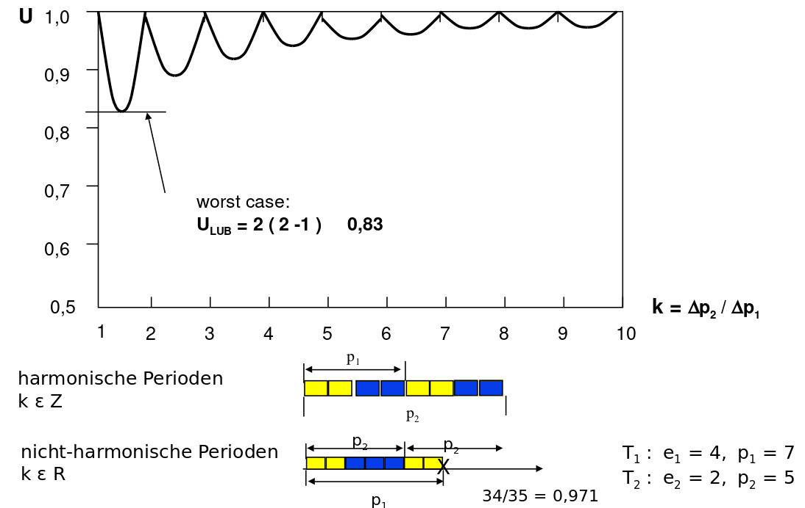

<!--
author:   Sebastian Zug, Karl Fessel & Andrè Dietrich
email:    sebastian.zug@informatik.tu-freiberg.de

version:  1.0.6
language: de
narrator: Deutsch Female

import:  https://raw.githubusercontent.com/liascript-templates/plantUML/master/README.md
         https://github.com/LiaTemplates/AVR8js/main/README.md
         https://github.com/LiaTemplates/Pyodide

icon: https://upload.wikimedia.org/wikipedia/commons/d/de/Logo_TU_Bergakademie_Freiberg.svg
-->


[](https://liascript.github.io/course/?https://github.com/TUBAF-IfI-LiaScript/VL_DigitaleSysteme/main/lectures/08_RTOS_Schedulingalgorithmen.md#1)


# Scheduling Algorithmen

| Parameter                | Kursinformationen                                                                                                                                                                                    |
| ------------------------ | ---------------------------------------------------------------------------------------------------------------------------------------------------------------------------------------------------- |
| **Veranstaltung:**       | `Vorlesung Softwareentwicklung für eingebettete Systeme`                                                                                                                                                           |
| **Semester**             | `Sommersemester 2024`                                                                                                                                                                                              |
| **Hochschule:**          | `Technische Universität Freiberg`                                                                                                                                                                    |
| **Inhalte:**             | `Scheduling Algorithmen`                                                                                                                                                             |
| **Link auf den GitHub:** | [https://github.com/TUBAF-IfI-LiaScript/VL_DigitaleSysteme/blob/main/lectures/08_RTOS_Schedulingalgorithmen.md](https://github.com/TUBAF-IfI-LiaScript/VL_DigitaleSysteme/blob/main/lectures/08_RTOS_Schedulingalgorithmen.md) |
| **Autoren**              | @author                                                                                                                                                                                              |


---

## Ausgangspunkt

<!--
style="width: 80%; min-width: 420px; max-width: 720px;"
-->
```ascii

                      +---------------------------------------+
Anforderungen der     | harte Echtzeit   | weiche Echtzeit    |
Anwendungen           +---------------------------------------+

                      +---------------------------------------+
                      | synchron bereit  | asynchron bereit   |
                      +---------------------------------------+
                      | periodisch | aperiodisch | sporadisch |
Taskmodell            +---------------------------------------+
                      | präemptiv        | nicht-präemtiv     |
                      +---------------------------------------+
                      | unabhängig       | abhängig           |
                      +---------------------------------------+

                      +---------------------------------------+
Scheduler             |statisch          | dynamisch          |
                      +---------------------------------------+
```

Wie können wir

- eine Menge von Tasks 		$T= {T_1, T_2, ..., T_n }$
- eine Menge von Prozessoren 	$P= {P_1, P_2, ..., P_m }$
- eine Menge von Ressourcen	$R= {R_1, R_2, ..., R_s }$

entsprechend den Anforderungen systematisch einplanen?

## Aperiodisches Scheduling  


### Durchsuchen des Lösungsraumes

Gegeben sei eine Menge ${T_i}$ nicht unterbrechbarer Tasks mit einer

+ Bereitzeit $r_i$
+ Ausführungszeit $\Delta e_i$
+ Deadline $c_i$

Ein statisches Planungsverfahren soll untersuchen, ob ein Plan existiert. Das Verfahren soll einen Plan in Form einer Folge von Tupeln $(i, s_i)$ generieren. $i$ bezeichnet dabei die Tasknummer und $s_i$ die bestimmte Startzeit.

Das Durchsuchen lässt sich anhand einer Baumstruktur darstellen


Beispiel: Gegeben sei unten stehend folge von 3 Tasks mit unterschiedlichen Ausführungsdauern, Bereitzeiten und Deadlines.



### Earliest Due Date

EDD zielt auf das Scheduling für einen Prozessor. Alle $n$ Tasks sind unabhängig
voneinander und <ins>können zur gleichen Zeit begonnen werden (zum
Zeitpunkt 0).</ins>

> EDD: Earliest Due Date (Jackson, 1955) Jeder Algorithmus, der die Tasks in der Reihenfolge nicht abnehmender Deadlines ausführt, ist optimal bzgl. der Minimierung der maximalen Verspätung.

Am Beispiel des EDD soll das Wesen der Entwicklung von Scheduling-Algorithmen verdeutlicht werden - der notwendige Beweis der Optimalität hinsichtlich der Verspätung.

Die Darstellung entstammt der Darstellung von (Buttazzo, 2002) die von (Marwedel 2003) aufgegriffen wurde: Sei A ein beliebiger Algorithmus, der verschieden von EDD ist. Dann gibt es zwei Tasks $T_a$ und $T_b$ in dem von $A$ erzeugten Schedule $\sigma$, so dass in $\sigma$ der Task $T_b$ unmittelbar vor $T_a$ steht, aber $d_a \leq d_b$ ist:

<!--
style="width: 80%; min-width: 420px; max-width: 720px;"
-->
```ascii
                                           "$d_a$"   "$d_b$"   
----------------------------------------------|-------|------------>
                        "$c_b$"       "$c_a$"
.........+----------------+-------------+..............
         |   "$T_b$"      |   "$T_a$"   |               
.........+----------------+-------------+..............                        .
```

Die zu erwartende Lateness $L_{max(a,b)}$ ergibt sich damit zu $c_a - d_a$.

EDD würde der Idee nach die Reihung umkehren. Damit ergibt sich die Frage, ob der
Algorithmus einen im Sinne von $L_{max}$ günstigere Variante identifiziert.

<!--
style="width: 80%; min-width: 420px; max-width: 720px;"
-->
```ascii
                                          "$d_a$"   "$d_b$"   
----------------------------------------------|-------|------------>

                        "$c_b$"       "$c_a$"
.........+----------------+-------------+..............
         |   "$T_b$"      |   "$T_a$"   |               
.........+----------------+-------------+..............     

                     "$c'_a$"          "$c'_b=c_a$"
.........+-------------+----------------+..............
         |   "$T_a$"   |     "$T_b$"    |     "$L'_{max(a,b)} = max(L'_a, L'_b)$"       
.........+-------------+----------------+..............                        
                               "$L'_a$"
                        <-------------------->
                                         <---------->
                                           "$L'_b$"                            .
```

Für die EDD Variante muss die $L_{max}$ anhand einer Fallunterscheidung bestimmt werden, da  "$L'_{max(a,b)} = max(L'_a, L'_b)$". Das Ergebnis hängt von der Dauer der beiden Tasks sowie der Relation zwischen der Bereitzeit und den Deadlines ab.

1. Variante ($L'_a \geq L'_b$)

Entsprechend ist $L'_{max(a,b)} = L'_a = c'_a - d_a$ gegeben. Dabei gilt $L'_a < L_{max(a,b)}$ da $c'_a - d_a < c_a - d_a$ mit $c'_a < c_a$.

2. Variante ($L'_a \leq L'_b$)

Hier gilt $L'_{max(a,b)} = L'_b = c'_b - d_b$. Unter Berücksichtigung von $c'_b=c_a$ folgt $c_a - d_b < c_a - d_a$. Da $d_a < d_b$ ergibt sich $L'_b \leq L_{max(a,b)} $

In beiden Fällen ist $L'_{max(a,b)}\leq L_{max(a,b)}$. Jeder Schedule kann mit endlich vielen Vertauschungen in einen EDD Schedule verwandelt werden, der die maximale Verspätung verkleinert.

> EDD generiert bei nicht unterbrechbaren Tasks einen Schedule der optimal im Hinblick auf maximale Verspätung ist. Für die Brauchbarkeit eines Plans gilt: falls EDD keinen gültigen Plan liefert, gibt es keinen !

### Earliest Deadline First

> [Horn, 1974]: Wenn eine Menge von n Tasks mit beliebigen Ankunftszeiten gegeben ist, so ist ein Algorithmus, der zu jedem Zeitpunkt diejenige ausführungsbereite Task mit der frühesten absoluten Deadline ausführt, optimal in Bezug auf die Minimierung der maximalen Verspätung.

Für die Umsetzung bedeutet dies, dass für jede ankommende ausführbare Task wird entsprechend ihrer absoluten Deadline in die Warteschleife der ausführbaren Tasks eingereiht. Wird eine neu ankommende Task als erstes Element in die Warteschlange eingefügt, muss gerade ausgeführte Task **unterbrochen** werden

<!--
style="width: 80%; min-width: 420px; max-width: 720px;"
-->
```ascii

Sortierte Liste der Tasks mit ihren Deadlines
+-------------------------------------------+-------+
| T1(52) T9(46) T2(32) T3(32) T5(17) T6(12) | T8(6) | Aktuell in Ausführung
+-------------------------------------------+-------+ befindlicher Task        .
```


Der Scheduling-Algorithmus wird mit dem Bereitwerden eines Tasks erneut
ausgeführt, dass heißt an den Punkten ${r_0, r_1, r_2}$ erfolgt die Prüfung der Deadlines.

Beispiel:

<!-- data-type="none" -->
| Task  | Bereitzeit $r_i$ | Ausführungsdauer $\Delta e_i$ | Deadline $d_i$ |
| ----- | ---------------- | --------------------------- | ------------ |
| $T_1$ | 0                | 10                          | 33           |
| $T_2$ | 4                | 3                           | 28           |
| $T_3$ | 5                | 10                          | 29           |

<!--
style="width: 80%; min-width: 420px; max-width: 720px;"
-->
```ascii
                     4                                             6
            T1  |XXXXXXXXXX   3                            XXXXXXXXXXXXXXX
            T2  |          XXXXXXX           10
            T3  |                 XXXXXXXXXXXXXXXXXXXXXXXXX
                +----|----|----|----|----|----|----|----|----|----|----|----|->
                0    2    4  : 6  : 8   10   12   14   16  :18   20   22   24   
                :         :  :    :                        :
Bereite Tasks   T1        T1 T1   T1                       T1             
                :         T2 T2                            :       
                :            T3   T3                       :         
Kürz. Deadline  T1        T2 T2   T3                       T1         
```

Argumente für EDF:

+ EDF ist dabei sehr flexibel, denn es kann sowohl für präemptives, wie auch für kooperatives Multitasking verwendet werden.
+ Es können Pläne für aperiodischen sowie periodischen Task entwickelt werden.
+ EDF kann den Prozessor bis zur maximalen Prozessorauslastung einplanen.
+ EDF ist ein optimaler Algorithmus.

### Least Laxity

Das Least Laxity (LL) oder Least-Slack-Time-Scheduling (LST) Scheduling weist die Priorität auf der Grundlage des verbleibenden Spielraums zu. Dieser Begriff beschreibt das bis zur Dealine bestehende Zeitintervall bezogen auf den noch nicht realisierten Anteil der Ausführungsdauer.

Entsprechend wird der Spielraum jedes Tasks (Deadline minus noch benötigte Rechenzeit) mit
jedem Schritt neu bestimmt. LL ist ebenfalls optimal im Hinblick auf die Minimierung der Maximalen
Verspätung.

> **Merke:** Least Laxity berücksichtig im Unterschied zu EDF die Ausführungsdauer. Damit ist das Verfahren in der Lage vor der Kollision mit der Deadline eine Notifizierung durchzuführen.

Beispiel:

<!-- data-type="none" -->
| Task  | Bereitzeit $r_i$ | Ausführungsdauer $\Delta e_i$ | Deadline $d_i$ |
| ----- | ---------------- | --------------------------- | ------------ |
| $T_1$ | 0                | 10                          | 33           |
| $T_2$ | 4                | 3                           | 28           |
| $T_3$ | 5                | 10                          | 29           |

Zu den Zeitpunkten $t_4$ und $t_{13}$ stellt sich die _Laxity_ entsprechend wie folgt dar:

<!-- data-type="none" -->
| Zeitpunkt | Laxity $T_1$       | Laxity $T_2$       | Laxity $T_3$      |
| --------- | ------------------ | ------------------ | ----------------- |
| $t_4$     | (33 - 4) - 6 = 23  | (28 -4) - 3 = 21   | -                 |
| $t_{13}$  | (33 - 13) - 6 = 14 | (28 - 13) - 2 = 13 | (29 -13) - 2 = 14 |


<!--
style="width: 80%; min-width: 420px; max-width: 720px;"
-->
```ascii

            T1  |XXXXXXXXXX                              XXXXX  XXXXXXXXXX
            T2  |          XX                    XXXXX
            T3  |            XXXXXXXXXXXXXXXXXXXX     XXX     XX
                +----|----|----|----|----|----|----|----|----|----|----|----|->
                0    2    4    6    8   10   12  :14   16   18   20   22   24   
                          :                      :     
                         "$t_4$"                "$t_{13}$"
```

### Latest Deadline First

Abhängigkeiten zwischen Tasks lassen sich in den bisher besprochenen Algorithmen noch nicht abbilden. Entsprechend würde ein EDF für folgendes Bespiel auch ein ungültiges Resultat liefern:



Gegeben: Taskmenge abhängiger Tasks $T = {T_1 , .., T_n}$ und ein azyklischer gerichteter
Graph, der die Vorrangrelation beschreibt.

Aus der Menge der Tasks deren Nachfolger bereits alle ausgewählt wurden oder die keinen Nachfolger besitzen, wählt LDF die Task mit der spätesten Deadline aus. __Die Warteschlange der Tasks wird also in der Reihenfolge der zuletzt auszuführenden Tasks aufgebaut.__ LDF ist ein optimaler Scheduler (Lawler 1973).

Beispiel



Damit ergibt sich ein gültiger Plan mit: $T_1, T_2, T_4, T_3, T_5, T_6$.


### EDF\*

EDF\* bezeichnet einen angepassten EDF Algorithmus unter Berücksichtigung der Vorrangrelation. Die Idee besteht darin, dass die Menge abhängiger Tasks in eine Menge unabhängiger Tasks durch Modifikation der Bereitzeiten und der Deadlines umgewandelt wird.

Entsprechen implementiert der EDF\* folgende drei Schritte:

1. Modifikation der Bereitzeiten
2. Modifikation der Deadlines
3. Schedule nach EDF erstellen

Bedingungen:

+ Ein Task kann nicht vor ihrer Bereitzeit ausgeführt werden.
+ Ein abhängiger Task kann keine Bereitzeit besitzen die kleiner ist als die Bereitzeit der Task von der sie abhängt.
+ Ein Task $T_b$, die von einer anderen Task $T_a$ abhängt, kann keine Deadline $d_b \leq d_a$ besitzen.

**Schritt 1: Modifikation der Bereitzeiten**



1. Für einen beliebige Anfangsknoten des Vorrang-Graphen setze $r^*_i = r_i$.
2. Wähle eine Task $T_i$, deren Bereitzeit (noch) nicht modifiziert wurde, aber deren Vorgänger $T_v$ alle modifizierte Bereitzeiten besitzen. Wenn es keine solche Task gibt: EXIT.
3. Setze $r^*_i = max [r_i  , max(r^*_v  + \Delta e_v ): T_v]$. Damit wird die maximale _Completion-Time_ der Vorgänger bestimmt $max(r^*_v  + \Delta e_v :  T_v)$
4. Gehe nach Schritt 2.

**Schritt 2: Modifikation der Deadlines**


1. Für einen beliebige Endknoten des Vorrang-Graphen setze $d^*_i = d_i$ .
2. Wähle eine Task $T_i$ , deren Deadline (noch) nicht modifiziert wurde, aber deren unmittelbare Nachfolger alle modifizierte Deadlines besitzen.  Wenn es keine solche Task gibt: EXIT.
3. Setze $d^*_i = min [d_i, min(d^*_n - \Delta e_n : T_n )]$.
4. Gehe nach Schritt 2

**Beispiel**


### Zusammenfassung


## Periodisches Scheduling  

Annahmen:

1. Alle Tasks mit harter Deadline sind periodisch.
2. Die Tasks sind unterbrechbar.
3. Die Deadlines entsprechend den Perioden.
4. Alle Tasks sind voneinander unabhängig.
5. Die Zeit für einen Kontextwechsel ist vernachlässigbar.
6. Für einen Prozessor und n Tasks gilt die folgende Gleichung bzgl. der durchschnittlichen Auslastung :
$$
U = \sum_{(i=1,...,n)} (\Delta e_i / \Delta p_i )
$$

Idee des Rate Monotonic Scheduling - Es wird kein expliziter Plan aufgestellt, der (zeitbasiert) auf Fristen oder Spielräumen beruht, sondern es existiert ein impliziter Plan, der durch eine Prioritätszuordnung zu allen Tasks repräsentiert wird.

Planungswerkzeug ist damit die Rate einer periodischen Task - die Anzahl der Perioden im Beobachtungszeitraum. Die Prioritätszuordnung erfolgt dann gemäß:

$rms(i) < rms(j)$ für $\frac{1}{\Delta p_i} < \frac{1} {\Delta p_j}$

Anwendung:


Grenzen des Verfahrens:



Frage: Gibt es eine obere Schranke $U_{lub}$  der Prozessorauslastung, für die immer ein Plan nach RMS garantiert werden kann (d.h. ein hinreichendes Kriterium für die Einplanbarkeit) ?

 $U_{lub}$  ist die Auslastung, für die RMS optimal ist, d.h. einen Plan findet, wenn überhaupt einer existiert.  Es kann natürlich Verfahren geben, die eine bessere Auslastung realisieren.

Nach (Liu, Layland, 1973) gilt für $n$ Tasks:     $U_{lub} =  n  (2^{1/n} - 1 )$.

| n                    | Obere Schranke           |
| -------------------- | ------------------------ |
| $1$                  | $U_{lub} = 1$            |
| $2$                  | $U_{lub} = 0.82$         |
| $n\rightarrow\infty$ | $U_{lub} =ln(2) = 0.693$ |

> **Achtung:** EDF ist sehr wohl in der Lage eine Auslastung von 100 Prozent zu realsieren.




**Zusammenfassung RMS**

Für alle Ausführungszeiten und Periodenverhältnisse von n Tasks wird unter RMS ein gültiger Plan gefunden, wenn die Auslastung die Schranke von  nicht übersteigt.

RMS ist einfacher zu realisieren als EDF, die Prioritäten anhand der Perioden werden einmal zu Beginn festgelegt.

Aber RMS ist nicht immer in der Lage eine Lösung zu finden, obwohl eine existiert. Entsprechend ist RMS kein optimaler Scheduler!

## Verwendung von Echtzeitbetriebssystemen

Ein Echtzeitbetriebssystem (RTOS) ist ein Betriebssystem (OS), das für Echtzeitanwendungen vorgesehen ist.  Ereignisgesteuerte Systeme schalten zwischen Tasks auf der Grundlage ihrer Prioritäten um, während Time-Sharing-Systeme die Tasks auf der Grundlage von Taktinterrupts umschalten. Die meisten RTOSs verwenden einen präemptiven Scheduling-Algorithmus.


Vorteile des RTOS vs. Super Loop Design

- Trennung von Funktionalität und Timing - RTOS entlastet den Nutzer und behandelt Timing, Signale und Kommunikation
- explizite Definition von Prioritäten - deutliche bessere Skalierbarkeit als im SLD
- Mischung von Hard- und Softrealtime Komponenten
- Verbesserte Wiederverwendbarkeit des Codes insbesondere bei Hardwarewechseln

")

FreeRTOS ist für leistungsschwache eingebettete Systeme konzipiert. Der Kernel selbst besteht aus nur drei C-Dateien. Um den Code lesbar, einfach zu portieren und wartbar zu machen, ist er größtenteils in C geschrieben, aber es sind einige Assembler-Funktionen (meist in architekturspezifischen Scheduler-Routinen) enthalten.

Es gibt keine der erweiterten Funktionen, die typischerweise in Betriebssystemen wie Linux oder Microsoft Windows zu finden sind, wie z. B. Gerätetreiber, erweiterte Speicherverwaltung, Benutzerkonten und Netzwerke. Der Schwerpunkt liegt auf Kompaktheit und Geschwindigkeit der Ausführung. FreeRTOS kann eher als "Thread-Bibliothek" denn als "Betriebssystem" betrachtet werden, obwohl eine Kommandozeilenschnittstelle und POSIX-ähnliche E/A-Abstraktionserweiterungen verfügbar sind.

FreeRTOS implementiert mehrere Threads, indem es das Host-Programm in regelmäßigen kurzen Abständen eine Thread-Tick-Methode aufrufen lässt. Die Thread-Tick-Methode schaltet Tasks abhängig von der Priorität und einem Round-Robin-Schema um. Das übliche Intervall beträgt 1 bis 10 Millisekunden (1/1000 bis 1/100 einer Sekunde), über einen Interrupt von einem Hardware-Timer, aber dieses Intervall wird oft geändert, um einer bestimmten Anwendung zu entsprechen.

### FreeRTOS Grundlagen

Das Task Modell unterscheidet 4 Zustände: Running, Blocked, Suspended, Ready, die mit entsprechenden API Funktionen manipuliert werden können, bzw. durch den Scheduler gesetzt werden. FreeRTOS implmentiert dafür einen präemptiven und einen kooperativen Multitasking Mode.

<!--
style="width: 80%;"
-->
```ascii
                        präemptiv                              kooperativ
Höchste         ^                                        ^                                 
Priorität   T1  |          XXXXXXXXXX                T1  |                    XXXXXXXXXX            
            T2  |XXXXXXXXXX         XXXXXXXXXX       T2  |XXXXXXXXXXXXXXXXXXXX     
                +----|----|----|----|----|----|->        +----|----|----|----|----|----|->
                0    2    4    6    8   10   12          0    2    4    6    8   10   12   
```

Der FreeRTOS-Echtzeit-Kernel misst die Zeit mit einer Tick-Count-Variable. Ein Timer-Interrupt (der RTOS-Tick-Interrupt) inkrementiert den Tick-Count - so kann der Echtzeit-Kernel die Zeit mit einer Auflösung der gewählten Timer-Interrupt-Frequenz messen.

Jedes Mal, wenn der Tick-Count inkrementiert wird, muss der Echtzeit-Kernel prüfen, ob es nun an der Zeit ist, einen Task zu entsperren oder aufzuwecken. Es ist möglich, dass ein Task, die während des Tick-ISRs geweckt oder entsperrt wird, eine höhere Priorität hat als der unterbrochene Task. Wenn dies der Fall ist, sollte der Tick-ISR zum neu geweckten/entblockten Task zurückkehren - effektiv unterbricht er einen Task, kehrt aber zu einer anderen zurück.

> **Merke:** Das präemptive Scheduling erfordert sowohl auf de Planungsebene, als auch auf der Verwaltungsebene einen größeren Overhead.

FreeRTOS unterstützt 2 Strategien für die Speicherbereitstellung, eine statische und eine dynamische Allokation. Während die erste Variante es der Anwendung überlässt die notwendigen Speicherareale zu aquirieren, über nimmt das RTOS diese Aufgabe im zweiten Modus. Der angeforderte Speicher wird auf dem Heap abgelegt. Mit dem Aufruf von `xTaskCreate()` wird ein Speicherblock alloziert, so dass der Stack und der _task control block_ (TCB) dort abgelegt werden können. Queues, Mutexe und Semaphoren werden ebenfalls dort eingebunden.  

<!--
style="width: 80%;"
-->
```ascii
        Arbeitsspeicher AVR
Ende    +------------------+
        | Stack für main   |
        | und IRQs         |
        |                  |
        |                  |
        +------------------+
        | freier Speicher  |
        |                  |      +---------------+
        |                  |   /  | TCB Tasks A   |
        +------------------+  /   +---------------+
        | HEAP             |      | Stack Tasks A |
        | verwaltet von    |      +---------------+
        | FreeRTOS         |      | Queue X       |        
        +------------------+  \   +---------------+
        | HEAP für main    |   \  |               | free Space
        |                  |      +---------------+                  
Start   +------------------+                                                   .

```

Beim Kontextwechsel sind auf dem AVR folgende Elemente auf dem Taskzugehörigen Stack zu speichern:

+ 32 general purpose processor Register
+ Status register
+ Program counter
+ 2 stack pointer registers.

```asm
#define portSAVE_CONTEXT()           
asm volatile (	                     
  "push  r0                    nt"
  ; Das Prozessorregister R0 wird zuerst gespeichert, da es beim Speichern des
  ; Statusregisters verwendet wird und mit seinem ursprünglichen Wert gespeichert
  ; werden muss.
  "in    r0, __SREG__          nt"
  "cli                         nt"
  "push  r0                    nt"
  ; Das Statusregister wird in R0 verschoben, damit es auf dem Stack gespeichert
  ; werden kann.
  "push  r1                    nt"
  "clr   r1                    nt"
  ; Der vom Compiler aus dem ISR-C-Quellcode generierte Code geht davon aus, dass
  ; R1 auf Null gesetzt ist. Der ursprüngliche Wert von R1 wird gespeichert,
  ; bevor R1 gelöscht wird.
  "push  r2                    nt"
  ...
  "push  r31                   nt"
  ; Sichern aller verbliebenen Register auf dem Stack
  "lds   r26, pxCurrentTCB     nt"
  "lds   r27, pxCurrentTCB + 1 nt"
  "in    r0, __SP_L__          nt"
  "st    x+, r0                nt"
  "in    r0, __SP_H__          nt"
  "st    x+, r0                nt"
  ; Sichern des Stackpointers auf dem Stack
);
```

Die TCB enthält unter anderem:

+ die Informationen zur Speicherverwaltung - Adresse der Stack-Startadresse in `pxStack` und den aktuellen Stackanfang in `pxTopOfStack`. FreeRTOS speichert auch einen Zeiger auf das Ende des Stacks in `pxEndOfStack`.
+ die anfängliche Priorität und die aktuelle Priorität des Tasks in `uxBasePriority` und `uxPriority`
+ den Namen des Tasks

Man könnte erwarten, dass jeder Task eine Variable hat, die FreeRTOS mitteilt, in welchem Zustand er sich befindet, aber das tut sie nicht. Stattdessen verfolgt FreeRTOS den Zustand des Tasks implizit, indem es den Task in die entsprechende Liste einträgt: ready list, suspended list, etc. Das Vorhandensein einer Aufgabe in einer bestimmten Liste zeigt den Zustand der Aufgabe an. Wenn ein Task von einem Zustand in einen anderen wechselt, verschiebt FreeRTOS ihn einfach von einer Liste in eine andere.

```c
typedef struct tskTaskControlBlock
{
  volatile portSTACK_TYPE *pxTopOfStack;                  /* Points to the location of
                                                             the last item placed on
                                                             the tasks stack.  THIS
                                                             MUST BE THE FIRST MEMBER
                                                             OF THE STRUCT. */
  unsigned portBASE_TYPE uxPriority;                      /* The priority of the task
                                                             where 0 is the lowest
                                                             priority. */
  portSTACK_TYPE *pxStack;                                /* Points to the start of
                                                             the stack. */
  signed char pcTaskName[ configMAX_TASK_NAME_LEN ];      /* Descriptive name given
                                                             to the task when created.
                                                             Facilitates debugging
                                                             only. */
  // ...

} tskTCB;
```

### Implementierung Grundlagen

Die generellen Parameter einer FreeRTOS-Anwendung finden sich in der Datei [FreeRTOSConfig.h](https://github.com/Infineon/freertos/blob/master/Source/portable/COMPONENT_CM33/FreeRTOSConfig.h).

| FreeRTOS Parameter         | Bedeutung                                                                                                                             |
| -------------------------- | ------------------------------------------------------------------------------------------------------------------------------------- |
| `configTOTAL_HEAP_SIZE`    | Größe des maximal verwendeten Gesamtspeichers aller Tasks usw.                                                                        |
| `configMINIMAL_STACK_SIZE` | Angabe der Minimalen Stackgröße                                                                                                       |
| `configMAX_PRIORITIES`     | Definition der Zahl der Prioritäten. Daraus folgt die Zahl der notwendigerweise zu etablierenden Listen für die Verwaltung der Tasks. |
| `configCPU_CLOCK_HZ`       | Taktfrequenz des Prozessors                                                                                                           |
| `configTICK_RATE_HZ`       |                                                                                                                                       |

> **Achtung!** Die verwendete Implementierung für den AVR lässt einzelne Einstellungsmöglichkeiten außer Acht und realisiert diese fest im Code oder implementiert eigene Konfigurationsmethoden.

```c   TaskBasicStructure.c
xTaskCreate( TaskBlink
 ,  "Blink"   // A name just for humans
 ,  128       // This stack size can be checked & adjusted by reading the Stack Highwater
 ,  NULL      //Parameters passed to the task function
 ,  2         // Priority, with 2 (configMAX_PRIORITIES - 1) being the highest, and 0 being the lowest.
 ,  &TaskBlink_Handler ); //Task handle


static void TaskBlinkRedLED(void *pvParameters) // Main LED Flash
{
   while(1)
   {
       PINB = ( 1 << PB5 );
       vTaskDelay(1000/portTick_PERIOD_MS); // wait for one second
   }
}

vTaskStartScheduler();
```

> **Merke:** Die bisherigen Zeitfunktionen `_delay_ms()` und `_delay_us()` werden durch RTOS spezifische Funktionen ersetzt. Damit wird die Kontrolle an den Scheduler zurückgegeben.

Eine Vorgehen, um auch die Laufzeit der eigentlichen Anwendung zu berücksichtigen, ist die Überwachung anhand von `vTaskDelayUntil()`:


```c   TaskBasicStructure.c
// Perform an action every 10 ticks.
void vTaskFunction( void * pvParameters )
{
TickType_t xLastWakeTime;
const TickType_t xFrequency = 10;

    // Initialise the xLastWakeTime variable with the current time.
    xLastWakeTime = xTaskGetTickCount();

    for( ;; )
    {
        // Wait for the next cycle.
        vTaskDelayUntil( &xLastWakeTime, xFrequency );

        // Perform action here.
    }
}
```

### Schedulingvarianten

```c cooperativeScheduling.c
static void TaskBlinkRedLED(void *pvParameters) // Main LED Flash
{
    TickType_t xLastWakeTime;
    xLastWakeTime = xTaskGetTickCount();
    while(1)
    {
        PORTB |= ( 1 << PB5 );
        vTaskDelayUntil( &xLastWakeTime, ( 100 / portTICK_PERIOD_MS ) );
        PORTB &= ~( 1 << PB5 );
        vTaskDelayUntil( &xLastWakeTime, ( 400 / portTICK_PERIOD_MS ) );
    }
}
```

```c preemtiveScheduling.c
static void WorkerTask(void *pvParameters)
{
  static uint32_t idelay;
  static uint32_t Delay;
  Delay = 10000000;
  /* Worker task Loop. */
  for(;;)
  {
    // Simulating some work here
	  for (idelay = 0; idelay < Delay; ++idelay);
  }
  /* Should never go there */
  vTaskDelete(worker_id);
}
```

### Kommunikation / Synchronisation zwischen Tasks

         {{0-1}}
*****************************************************************************

Bisher haben wir allein über isolierte Tasks gesprochen, die ohne Relation zu einander bestehen. FreeRTOS bietet fünf primäre Mechanismen für die Kommunikation zwischen Tasks: _queues_, _semaphores_, _mutexes_, _stream buffers_ und _message buffers_. Allen gemeinsam ist, dass sie dazu führen können, dass Tasks blockieren, wenn die Ressource oder die Daten eines anderen Tasks nicht verfügbar sind.

Beispiele:

+ Ein Semaphore sperrt bzw. gibt den Zugriff auf ein Display frei.
+ Ein Task wartet auf das Eintreffen des Ergebnisses eines anderen Tasks, das über eine Queue übermittelt wurde.

*****************************************************************************

         {{1-2}}
*****************************************************************************

__Queues__

Queues bieten eine Inter-Task-Kommunikation mit einer vom Benutzer definierbaren festen Länge. Der Entwickler gibt die Nachrichtenlänge bei der Erstellung der Warteschlange an. Dies geschieht durch den Aufruf

```c
QueueHandle_t queueName =xQueueCreate(queueLength, elementSize)
```

Der Eingabeparameter `queueLength` gibt die Anzahl der Elemente an, die die Warteschlange aufnehmen kann. `elementSize` gibt die Größe der einzelnen Elemente in Bytes an. Alle Elemente in der Warteschlange müssen die gleiche Größe haben. Die Warteschlange hat eine FIFO-Struktur (first in/first out), so dass der Empfänger immer das Element erhält, das als erstes eingefügt wurde.

*****************************************************************************

          {{2-3}}
*****************************************************************************

__Semaphoren__

Semaphore werden zur Synchronisation und zur Steuerung des Zugriffs auf gemeinsame Ressourcen zwischen Tasks verwendet. Ein Semaphor kann entweder binär oder zählend sein und ist im Wesentlichen nur ein nicht-negativer Integer-Zähler.

Ein binäres Semaphor wird auf 1 initialisiert und kann verwendet werden, um eine Ressource zu bewachen, die nur von einem Task zu einem Zeitpunkt gehandhabt werden kann. Wenn eine Task die Ressource übernimmt, wird der Semaphor auf 0 dekrementiert. Wenn ein anderer Task die Ressource verwenden möchte und sieht, dass der Semaphor 0 ist, blockiert sie. Wenn der erste Task mit der Nutzung der Ressource fertig ist, wird das Semaphor inkrementiert und steht damit anderen Tasks zur Verfügung.

Ein binärer Semaphor kann mit

```
SemaphoreHandle_t semaphoreName = xSemaphoreCreateBinary(void)
```

erstellt werden. Ein zählender Semaphor funktioniert auf die gleiche Weise, jedoch für Ressourcen, die von mehreren Tasks gleichzeitig verwendet werden können. Ein Zählsemaphor sollte auf die Anzahl der Tasks initialisiert werden, die gleichzeitig Zugriff auf die Ressource haben können, und wird mit

```
SemaphoreHandle_t semaphoreName =xSemaphoreCreateCounting(maxCount, initialCount)
```

erstellt. Wenn eine Task eine durch einen Semaphor geschützte Ressource wünscht, ruft sie die Funktion `xSemaphoreTake(semaphoreName,ticksToWait)` auf. Wenn der Semaphor zu 0 ausgewertet wird, blockiert die Task für die in ticksToWait angegebene Zeit. Wenn die Task mit der Verwendung des Semaphors fertig ist, wird die Funktion `xSemaphoreGive(semaphoreName)` aufgerufen.

*****************************************************************************

          {{3-4}}
*****************************************************************************

__Mutex__

Ein Mutex ist einem binären Semaphor sehr ähnlich, bietet aber zusätzlich einen Mechanismus zur Prioritätsvererbung. Wenn ein hochpriorer Task beim Zugriff auf eine Ressource blockiert wird, die bereits von einem niederprioren Task belegt ist, erbt der niederpriore Task die Priorität des hochprioren Tasks, bis er den Mutex freigegeben hat.

Dies stellt sicher, dass die Blockierzeit des hochprioren Tasks minimiert wird, da der niedrigpriore Task nun nicht mehr von anderen Tasks mit mittlerer Priorität präemptiert werden kann.

Eine Mutex wird mit der Funktion

```
semaphoreHandle_t mutexName = xSemaphoreCreateMutex(void)
```

erstellt. Mutexe sollten nicht von einem Interrupt aus verwendet werden, da der Mechanismus der Prioritätsvererbung nur für einen Task sinnvoll ist, nicht aber für ein Interrupt.

*****************************************************************************

          {{4-5}}
*****************************************************************************

__Beispiel__

Im Beispiel wird auf die Ressource Serielle Schnittstelle durch zwei Tasks zugegriffen. Um ein Überschreiben der Inhalte zu verhindern ist eine Synchronisation erforderlich.

[Codesammlung](https://github.com/TUBAF-IfI-LiaScript/VL_SoftwareentwicklungEingebetteteSysteme/blob/main/codeExamples/avr/FreeRTOS_taskHandling/src/main.cpp)

```c 
#include <Arduino.h>
#include <Arduino_FreeRTOS.h>
#include <semphr.h>  // add the FreeRTOS functions for Semaphores (or Flags).

SemaphoreHandle_t xSerialSemaphore;

void TaskA( void *pvParameters );
void TaskB( void *pvParameters );

void setup() {

  Serial.begin(9600);
  
  if ( xSerialSemaphore == NULL )  
  {
    xSerialSemaphore = xSemaphoreCreateMutex();  
    if ( ( xSerialSemaphore ) != NULL )
      xSemaphoreGive( ( xSerialSemaphore ) );  
  }

  xTaskCreate(
    TaskA
    ,  "A"  
    ,  128  
    ,  NULL
    ,  2  // Priority, with 3 (configMAX_PRIORITIES - 1) being the highest, and 0 being the lowest.
    ,  NULL );

  xTaskCreate(
    TaskB
    ,  "B"
    ,  128 
    ,  NULL
    ,  1  
    ,  NULL );

}

void loop()
{
  // Empty. Things are done in Tasks.
}

/*--------------------------------------------------*/
/*---------------------- Tasks ---------------------*/
/*--------------------------------------------------*/

void TaskA( void *pvParameters __attribute__((unused)) )  // This is a Task.
{
  for (;;) 
  {
    //Serial.println("AAAAAAAAAAAAAAAAAAAAAAAAAAAAAAAAAAAAAAAAAAAAAAAAAAAAAAAAAAAAAAAAAAAAAAAAAAAA");
    // If the semaphore is not available, wait 5 ticks of the Scheduler to see if it becomes free.
    if ( xSemaphoreTake( xSerialSemaphore, ( TickType_t ) 5 ) == pdTRUE )
    {
      Serial.println("AAAAAAAAAAAAAAAAAAAAAAAAAAAAAAAAAAAAAAAAAAAAAAAAAAAAAAAAAAAAAAAAAAAAAAAAAAAA");
      xSemaphoreGive( xSerialSemaphore );
    }

    vTaskDelay(1);  // one tick delay (15ms) in between reads for stability
  }
}

void TaskB( void *pvParameters __attribute__((unused)) )  // This is a Task.
{
  for (;;)
  {
    //Serial.println("BBBBBBBBBBBBBBBBBBBBBBBBBBBBBBBBBBBBBBBBBBBBBBBBBBBBBBBBBBBBBBBBBBBBBBBBBB");
    if ( xSemaphoreTake( xSerialSemaphore, ( TickType_t ) 5 ) == pdTRUE )
    {
      Serial.println("BBBBBBBBBBBBBBBBBBBBBBBBBBBBBBBBBBBBBBBBBBBBBBBBBBBBBBBBBBBBBBBBBBBBBBBBBB");
      xSemaphoreGive( xSerialSemaphore ); 
    }

    vTaskDelay(1);
  }
}
```

*****************************************************************************

### Denken wie ein RTOS Entwickler

")

!?[alt-text](https://www.youtube.com/watch?v=9UqIZW1PDUI)

## Warum das Ganze?

vgl. "What really happened to the software on the Mars Pathfinder spacecraft?"
