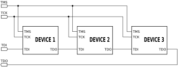
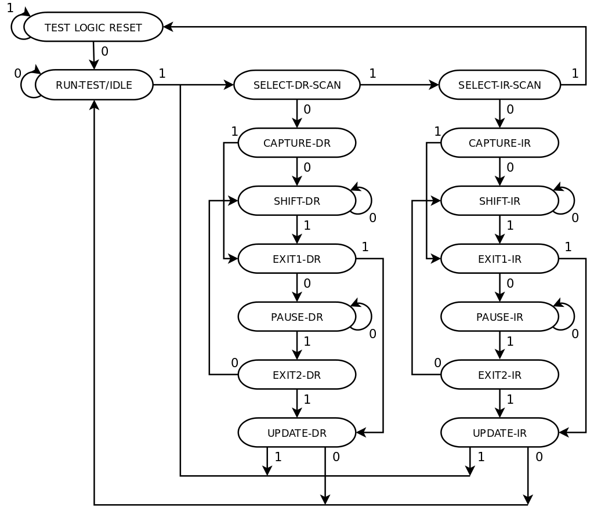
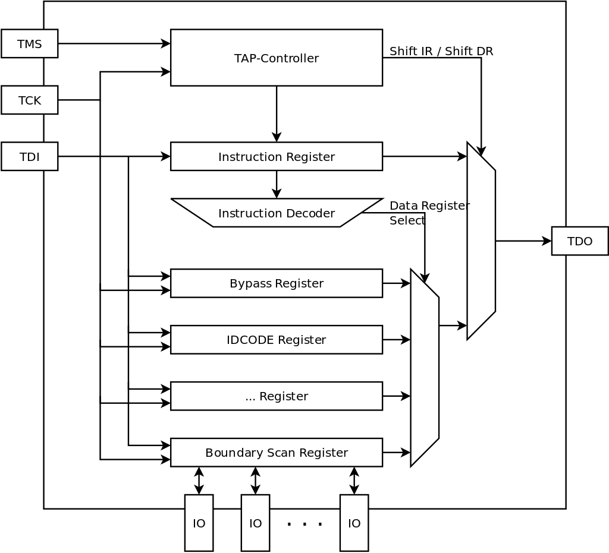
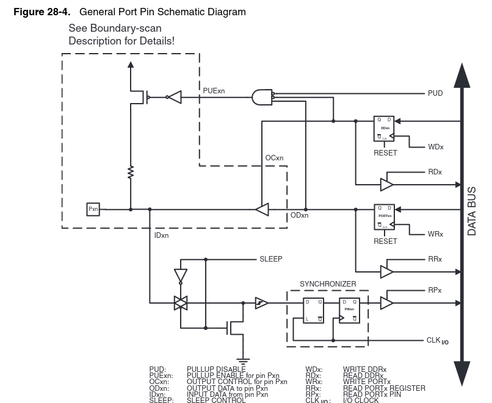
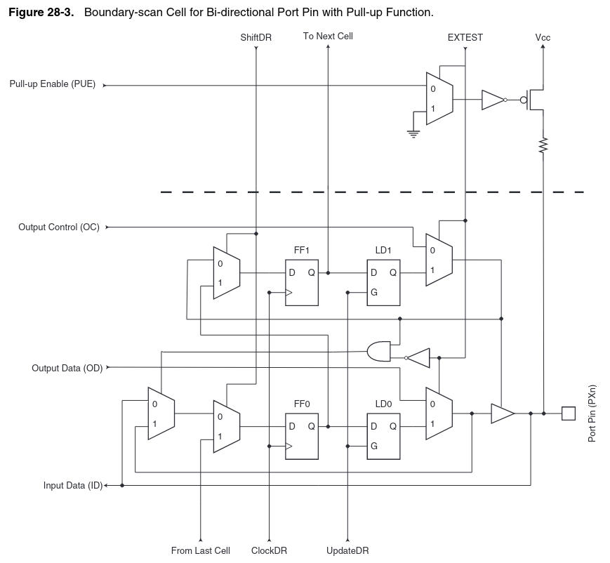
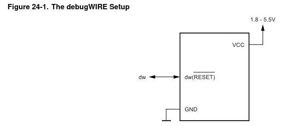
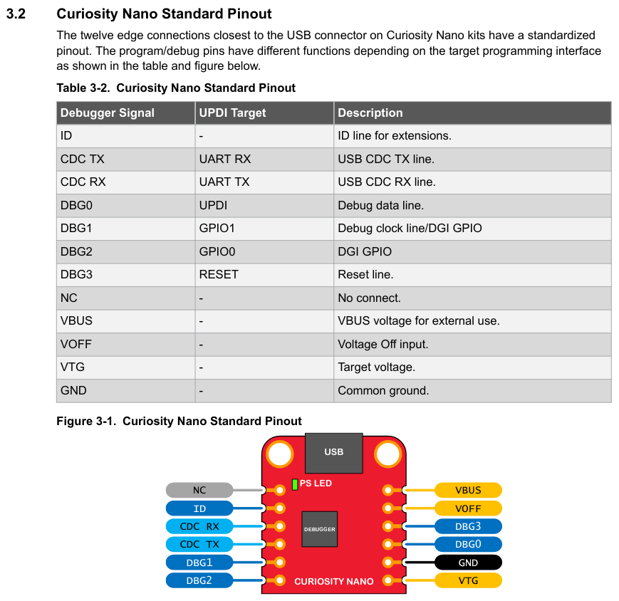
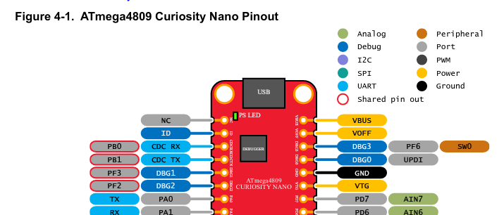
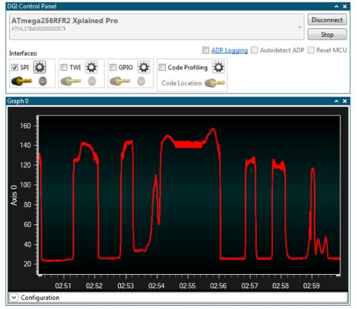

<!--
author:   Sebastian Zug, Karl Fessel & Andrè Dietrich
email:    sebastian.zug@informatik.tu-freiberg.de

version:  1.0.3
language: de
narrator: Deutsch Female

icon: https://upload.wikimedia.org/wikipedia/commons/d/de/Logo_TU_Bergakademie_Freiberg.svg

-->


[](https://liascript.github.io/course/?https://github.com/TUBAF-IfI-LiaScript/VL_DigitaleSysteme/main/lectures/13_Debugging.md#1)


# Debugging von eingebetteten Systemen

| Parameter                | Kursinformationen                                                                                                                                                                    |
| ------------------------ | ------------------------------------------------------------------------------------------------------------------------------------------------------------------------------------ |
| **Veranstaltung:**       | `Vorlesung Digitale Systeme`                                                                                                                                                      |
| **Semester**             | `Sommersemester 2022`                                                                                                                                                                |
| **Hochschule:**          | `Technische Universität Freiberg`                                                                                                                                                    |
| **Inhalte:**             | `Debuggingtechniken und Anwendungsbeispiel`                                                                                            |
| **Link auf den GitHub:** | [https://github.com/TUBAF-IfI-LiaScript/VL_DigitaleSysteme/blob/main/lectures/10_XMEGA_Abgrenzung.md](https://github.com/TUBAF-IfI-LiaScript/VL_DigitaleSysteme/blob/main/lectures/11_Debugging.md) |
| **Autoren**              | @author                                                                                                                                                                              |


---


## Debugging

Debugging für Speicher und leistungsbeschränkte Systeme (unter Echtzeitbedingungen) stellt andere Herausforderungen als konventionelle Analysemethoden. Gleichzeitig sind wir mit kniffligen Bugs konfrontiert mit _Race Conditions_, _Stack Overflows_ oder _Priority Inversions_.

* printf-Debugging bläht den Code auf, weil die zugehörigen Implementierungen integriert werden müssen.
* Debugging verändert das Laufzeitverhalten, entsprechend ist es möglich, dass die Ausführung des entsprechenden Codes durch den Overhead für die Analyse maskiert wird.
* auf dem Gerät steht gar nicht genügend Speicher zur Verfügung um längere Tracing-Aufzeichnungen umzusetzen

### Verschiedene Methoden für das Debuggen von eingebetteten Systemen:

Die Fehlersuche in eingebetteten Systemen ist aufgrund der komplexen Hardware und der Echtzeit-Anforderungen oft schwieriger als bei Desktop-Anwendungen. Es gibt verschiedene Methoden, die je nach Art des Systems und des Fehlers eingesetzt werden können:

**1. Statische Analyse:**

* **Code-Analyse:** Der Code wird statisch auf syntaktische und semantische Fehler sowie auf mögliche Probleme wie Pufferüberläufe oder Nullzeigerdereferenzen untersucht.
* **Statische Timing-Analyse:** Diese Analyse überprüft, ob der Code die Echtzeit-Anforderungen des Systems erfüllt.

**2. Laufzeitüberwachung:**

* **Debugger:** Debugger ermöglichen die schrittweise Ausführung des Codes, die Einstellung von Haltepunkten und die Überwachung von Variablen und Registern.
* **Tracing:** Relevante Daten aus dem Programmlauf werden aufgezeichnet und können später analysiert werden, um Fehler zu finden.
* **Assertionen:** Assertionen sind Annahmen über den Programmzustand, die zur Laufzeit überprüft werden. Wenn eine Assertion verletzt wird, weist dies auf einen Fehler hin.
* **Watchdogs:** Watchdogs sind Timer, die zurückgesetzt werden müssen, bevor sie ablaufen. Wenn ein Watchdog nicht rechtzeitig zurückgesetzt wird, weist dies darauf hin, dass das Programm in einer Schleife hängt oder anderweitig nicht richtig funktioniert.

> Die Laufzeitüberwachung kann durch eine zugehörige Hardware unterstützt werden, die spezielle Debugging/Tracing/Profiling-Funktionen bereitstellt. Um mit dieser zu interagieren, wird in der Regel ein spezieller Debugger benötigt.

Unterscheidungsmerkmale:

+ Simulation, Emulation vs. reale Hardware
+ veränderter Code vs. Originalcode
+ Debugging Features vs. bloße Ausführungsumgebung 
+ interner Debugger vs. externer Debugger

!?[alt-text](https://www.youtube.com/watch?v=NxxQZ3JyjiE "Aufbau eines Bed of Nails Testers")

```ascii

Serial
Data in                                           <--------+ Serial Data
---------+             +---------------------+             | out
         |             |                     |             |
         v             |                     v             |
       +-+-------------+-+                 +-+-------------+-+
       | |   CPU I     | |                 | |   CPU II    | |
       | |  +-------+  | |                 | |  +-------+  | |
     ▬-+-□--| Core  |--□-+-▬      +------▬-+-□--| Core  |--□-+-▬
       | |  | Logic |  | |        |        | |  | Logic |  | |
     ▬-+-□--|       |--□-+-▬------+      ▬-+-□--|       |--□-+-▬
       | |  |       |  | |        zu       | |  |       |  | |
     ▬-+-□--|       |--□-+-▬   testende  ▬-+-□--|       |--□-+-▬
       | |  +-------+  | |    Verbindung   | |  +-------+  | |
       | +-------------+ |                 | +-------------+ |
       +-----------------+                 +-----------------+

```

Ablauf im Testfall:

+ Erzeugung der Testmuster,
+ Anwendung der Testmuster,
+ Beobachtung des Systemverhaltens und ggf.
+ Vergleich der Ergebnisse

### Vergleich der Umsetzung


| Merkmal           | JTAG (Joint Test Action Group)     | DebugWire                                 | SWD (Serial Wire Debug)                  | UPDI (Unified Program and Debug Interface)|
|-------------------|-----------------------------------|-------------------------------------------|------------------------------------------|-------------------------------------------|
| Schnittstellentyp | Parallel, 4-5 Drähte              | Serielle, 1-Draht                         | Serielle, 1-Draht                        | Serielle, 1-Draht                         |
| Protokoll         | IEEE 1149.1 Standard              | Proprietär (von Atmel/Microchip)          | Teil des ARM Cortex-Debug-Interfaces     | Proprietär (von Atmel/Microchip)          |
| Verwendete Pins   | TDI, TDO, TCK, TMS (+ TRST, optional) | RESET/DEBUGWIRE                          | SWO                                      | RESET/UPDI                                |
| Geschwindigkeit   | Variiert, meist schnell           | Langsamer als JTAG                        | Hochgeschwindigkeit                      | Schnell                                  |
| Zielmikrocontroller | Weit verbreitet (ARM, FPGA, etc.) | Atmel AVR Mikrocontroller                | ARM Cortex-M Mikrocontroller             | Atmel/Microchip Mikrocontroller (z.B. tinyAVR, megaAVR) |
| Funktionalität    | Umfassendes Debugging, Programmierung, Boundary-Scan | Einfaches Debugging, Programmierung     | Debugging, Echtzeit-Datenübertragung     | Debugging, Programmierung                |
| Debug-Features    | Haltepunkte, Registeransicht, Speicheransicht | Grundlegende Debugging-Funktionen       | Haltepunkte, Registeransicht, Tracing    | Haltepunkte, Registeransicht             |
| Vorteile          | Leistungsfähig, weit verbreitet   | Einfach, benötigt nur einen Pin           | Effizient, Echtzeit-Datenübertragung      | Einfach, benötigt nur einen Pin           |
| Nachteile         | Komplexität, benötigt mehrere Pins | Langsamere Geschwindigkeit                | ARM-spezifisch                           | Weniger verbreitet als JTAG               |


- **JTAG**: Ein weit verbreiteter Standard, der für Debugging, Programmierung und Boundary-Scan verwendet wird. Es nutzt mehrere Pins und bietet umfassende Debugging-Möglichkeiten.
- **DebugWire**: Eine proprietäre Lösung von Atmel/Microchip, die für kleine AVR-Mikrocontroller gedacht ist. Sie benötigt nur einen Pin (RESET) und ist daher einfach zu verwenden, aber nicht so leistungsfähig wie JTAG.
- **SWO**: Ein Teil des ARM Cortex-Debug-Interfaces, der serielle Echtzeit-Datenübertragung für Debugging-Zwecke ermöglicht. Es nutzt einen einzigen Pin und bietet effiziente Datenübertragung und Debugging-Funktionen.
- **UPDI**: Eine proprietäre Lösung von Atmel/Microchip für neue Mikrocontroller-Serien wie die tinyAVR und megaAVR. Es kombiniert Debugging und Programmierung über einen einzigen Pin und ist für einfache Implementierung und Nutzung gedacht.

## JTAG

Joint Test Action Group (kurz JTAG) ist ein häufig verwendetes Synonym für das von der Arbeitsgruppe definierte Verfahren für den Boundary Scan Test nach IEEE 1149.1. Durch Hinzufügen weiterer Verfahren (1149.1–1149.8) sind die Begriffe nicht mehr synonym, während die Beschreibungssprache von der IEEE-Arbeitsgruppe mit Boundary Scan Description Language den ursprünglichen Namen beibehielt.



| Bezeichnung            | Bedeutung                                            |
| ---------------------- | ---------------------------------------------------- |
| Test Data Input (TDI)  | Serieller Eingang der Schieberegister.               |
| Test Data Output (TDO) | Serieller Ausgang der Schieberegister.               |
| Test Clock (TCK).      | Das Taktsignal für die gesamte Testlogik.            |
| Test Mode Select (TMS) | Diese steuert die State Machine des TAP-Controllers. |
| Test Reset (TRST)      | Reset der Testlogik (optional)                       |


Der TAP-Controller ist ein von TCK getakteter und von der TMS-Leitung gesteuerter Zustandsautomat. Die TMS-Leitung bestimmt dabei, in welchen Folgezustand beim nächsten Takt gesprungen wird. Der TAP-Controller hat sechs stabile Zustände, das heißt Zustände, in denen mehrere Takte lang verblieben werden kann. Diese sechs Zustände sind „Test Logic Reset“, „Run Test / Idle“, „Shift-DR“ und „Shift-IR“ sowie „Pause-DR“ und „Pause-IR“. Im Zustand „Test Logic Reset“ wird die Testlogik zurückgesetzt, „Run Test / Idle“ wird als Ruhezustand oder für Wartezeiten benutzt. Die beiden „Shift“-Zustände schieben jeweils das DR- oder IR-Schieberegister. Die beiden „Pause“-Zustände dienen der Unterbrechung von Schiebeoperationen. Aus allen anderen Zuständen wird beim folgenden Takt in einen anderen Zustand gesprungen. Beim Durchlaufen werden jeweils bestimmte Steuerfunktionen ausgelöst.





> Und auf den 8-Bit Atmel Controllern?

Die JTAG Funktionalität wird nur für einzelne Controllerfamilien unterstützt. Eine Variante sind die "größeren" ATmega1280 und ATmega2650.

Auszug aus dem Handbuch

```
JTAG (IEEE std. 1149.1 Compliant) Interface with access to:
+ all Internal Peripheral Units
+ Internal and External RAM
+ Internal Register File
+ Program Counter
+ EEPROM and Flash Memories

On-chip Debug Support for Break Conditions, Including
+ AVR Break Instruction
+ Break on Change of Program Memory Flow
+ Single Step Break
+ Program Memory Breakpoints on Single Address or Address Range
+ Data Memory Breakpoints on Single Address or Address Range
+ Programming of Flash, EEPROM, Fuses, and Lock Bits through the JTAG Interface
+ On-chip Debugging Supported by AVR Studio
```

https://ww1.microchip.com/downloads/en/devicedoc/atmel-2549-8-bit-avr-microcontroller-atmega640-1280-1281-2560-2561_datasheet.pdf





> **Merke:** Für die Verwendung ist ein eigener Programmer erforderlich.

> **Merke:**  JTAG ist im Auslieferungszustand des Arduino Mega ausgeschaltet!

[^JTAG_Chain]: Wikimedia, Author Vindicator, _ JTAG chain for programmable devices_, https://commons.wikimedia.org/wiki/File:Jtag_chain.svg

[^JTAG_Chain]: Wikimedia, Author Rudolph H, _Zustandsautomat eines JTAG TAP-Controllers. Die Einsen und Nullen geben den Zustand der TMS-Leitung an, dieser bestimmt, in welchen State bei der nächsten TCK gesprungen wird._, https://commons.wikimedia.org/wiki/File:JTAG_TAP_Controller_State_Diagram.svg

[^JTAG_Schema]: Wikimedia, Author Rudolph H, _Diagramm eines JTAG Test Access Ports mit den üblicherweise vorhandenen Datenregistern._, https://commons.wikimedia.org/wiki/File:JTAG_Register.svg

[^ATmega2560]: Firma Microchip, Handbuch ATmega640, ATmega1280 .... http://ww1.microchip.com/downloads/en/DeviceDoc/Atmel-2549-8-bit-AVR-Microcontroller-ATmega640-1280-1281-2560-2561_datasheet.pdf

## debugWire (ATmega328)

debugWIRE ist ein serielles Kommunikationsprotokoll, das als einfache Alternative zu JTAG eingeführt wurde und bei Prozessoren mit begrenzten Ressourcen – speziell wenigen Anschlusspins – eingesetzt wird. debugWIRE erlaubt vollen Lese- und Schreibzugriff auf den Speicher und die Überwachung des Programmflusses. Dabei können nur die Aktionen durchgeführt werden, die auch bei normalem Programmablauf möglich sind. Breakpoints werden durch Einfügen von Break-Opcodes (0x9598) in das Programm vor der Übertragung auf den Microcontroller gesetzt.

debugWIRE benutzt serielle Kommunikation über eine Ein-Draht-Leitung mit Open-Drain-Ankopplung. Die Standard-Taktrate ist 1/128 des Prozessortaktes. Eingeleitet wird die Kommunikation durch Senden des Break-Zustandes (alle Bits 0), als Antwort sendet der zu testende Prozessor das Byte 0x55, das aus abwechselnd Null- und Eins-Pegeln besteht. Dies erlaubt dem Debugger eine einfache Identifizierung der Taktrate.



> **Merke:** Der debugWIRE-Kommunikationspin liegt physikalisch auf demselben Pin wie der externe Reset (RESET). Eine externe Reset-Quelle wird daher nicht unterstützt, wenn das debugWIRE aktiviert ist!

!?[](https://www.youtube.com/watch?v=kI_Z78a_0y0)

Das DebugWire-Protokoll wurde zum Teil reverse-engineered [git](https://github.com/dcwbrown/dwire-debug) [protokoll](http://www.ruemohr.org/docs/debugwire.html)

[^ATmega328]: Firma Microchip, ATmega328P Data sheet, https://ww1.microchip.com/downloads/aemDocuments/documents/MCU08/ProductDocuments/DataSheets/ATmega48A-PA-88A-PA-168A-PA-328-P-DS-DS40002061B.pdf

## UPDI (ATmega4809)

Das Unified Program and Debug Interface (UPDI) ist eine weitere proprietäre Schnittstelle zur externen Programmierung und zum On-Chip Debugging eines Gerätes. Das UPDI unterstützt die Programmierung von nichtflüchtigem Speicher (NVM), FLASH, EEPROM, Fuses, Lockbits. Darüber hinaus kann das UPDI auf den gesamten I/O- und Datenbereich des Bausteins zugreifen.

Die Programmierung und das Debugging erfolgen über das UPDI Physical Interface (UPDI PHY), das ist eine Ein-Draht-UART-basierte Halbduplex-Schnittstelle, die einen eigenen Pin für den Datenempfang und -versand verwendet. Die Taktung des UPDI PHY erfolgt durch den internen Oszillator. UPDI bietet zwei Zugriffsmöglichkeiten zum einen über eine UPDI-Zugriffsschicht auf die Busmatrix der MCU zum anderen auf das Asynchronous System Interface.

Der Zugriff auf die Busmatrix, ermöglicht den Zugriff auf Systemblöcke wie Speicher, NVM und Peripheriegeräte über deren Speicherabbildungen (wie es auch der laufende Code kann).

Das Asynchronous System Interface (ASI) bietet direkten Schnittstellenzugriff auf On-Chip-Debugging (OCD), NVM und System-Management-Funktionen. Dadurch erhält der Debugger direkten Zugriff auf Systeminformationen, ohne dass ein Bus Zugriff erforderlich ist.


> Analysieren Sie das Instruktionsset des UPDI Protokolls im Handbuch!

Auch für das UPDI-Protokoll gibt es Nachbauten [git](https://github.com/ElTangas/jtag2updi) [gdb-adapter](https://github.com/stemnic/pyAVRdbg)

[^Microchip4809]: Firma Microchip, ATmega4808/4809 Data Sheet, [Link](http://ww1.microchip.com/downloads/en/DeviceDoc/ATmega4808-4809-Data-Sheet-DS40002173A.pdf)

## SWD

> ... zum Teil in Kombination mit JTAG 


| **Eigenschaft**                           | **Cortex-M0**          | **Cortex-M0+**         | **Cortex-M4**           |
| ----------------------------------------- | ---------------------- | ---------------------- | ----------------------- |
| **CoreSight Debug**                       | Ja                     | Ja                     | Ja                      |
| **Breakpoint Units**                      | 4 Hardware-Breakpoints | 4 Hardware-Breakpoints | 6 Hardware-Breakpoints  |
| **Watchpoint Units**                      | 2 Hardware-Watchpoints | 2 Hardware-Watchpoints | 4 Hardware-Watchpoints  |
| **Data Watchpoint and Trace (DWT)**       | Nein                   | Nein                   | Ja                      |
| **Instrumentation Trace Macrocell (ITM)** | Nein                   | Nein                   | Ja                      |
| **Embedded Trace Macrocell (ETM)**        | Nein                   | Optional               | Ja                      |
| **Flash Patch and Breakpoint (FPB)**      | Ja                     | Ja                     | Ja                      |
| **Debug Access Port (DAP)**               | Ja                     | Ja                     | Ja                      |
| **Serial Wire Debug (SWD)**               | Ja                     | Ja                     | Ja                      |
| **JTAG Debug**                            | Nein (nur SWD)         | Nein (nur SWD)         | Optional (SWD und JTAG) |


- **Breakpoint Units**:
  - Die Cortex-M0 und Cortex-M0+ Prozessoren verfügen über 4 Hardware-Breakpoints.
  - Der Cortex-M4 bietet 6 Hardware-Breakpoints, was eine feinere Kontrolle und mehr Debugging-Möglichkeiten ermöglicht.

- **Watchpoint Units**:
  - Die Cortex-M0 und Cortex-M0+ Prozessoren haben 2 Hardware-Watchpoints.
  - Der Cortex-M4 verfügt über 4 Hardware-Watchpoints, was die Überwachung von Speicherzugriffen erleichtert.

- **Data Watchpoint and Trace (DWT)**:
  - Dieses Feature ist nur im Cortex-M4 vorhanden und ermöglicht das Setzen von Daten-Watchpoints und das Erfassen von Ereignissen wie Zykluszählung und Exception-Triggering.

- **Instrumentation Trace Macrocell (ITM)**:
  - Nur der Cortex-M4 unterstützt ITM, was die Ausgabe von Debug- und Trace-Informationen in Echtzeit ermöglicht, um Ereignisse und printf-ähnliche Debugging-Funktionen zu unterstützen.

- **Embedded Trace Macrocell (ETM)**:
  - ETM ist beim Cortex-M0 nicht verfügbar, optional beim Cortex-M0+ und vollständig beim Cortex-M4 integriert. ETM ermöglicht detailliertes Echtzeit-Trace von Programmfluss.

- **Flash Patch and Breakpoint (FPB)**:
  - Alle drei Prozessoren unterstützen FPB, das die Implementierung von Breakpoints und die Neuzuweisung von Instruktionen im Flash-Speicher ermöglicht.

- **Debug Access Port (DAP)**:
  - Alle Prozessoren unterstützen DAP, was den Zugriff auf den Prozessor für Debugging und Programmierung ermöglicht.

- **Serial Wire Debug (SWD)**:
  - Alle Prozessoren unterstützen SWD, eine Alternative zu JTAG mit weniger Pins.

- **JTAG Debug**:
  - Cortex-M0 und Cortex-M0+ unterstützen kein JTAG, sondern nur SWD. Der Cortex-M4 unterstützt optional sowohl SWD als auch JTAG, was mehr Flexibilität für Debugging-Interfaces bietet.


### Hardware Breakpoints 

Hardware-Breakpoints in ARM-Controllern sind spezielle Debugging-Funktionen, die es ermöglichen, den Prozessor anzuhalten, wenn eine bestimmte Adresse im Programmcode erreicht wird. Dies ist besonders nützlich für das Debugging von eingebetteten Systemen, da es ermöglicht, den Zustand des Prozessors und des Speichers zu überprüfen, ohne den Programmablauf zu verändern.

1. **Implementierung in der Hardware**: Hardware-Breakpoints werden durch spezielle Register und Logik im Debug-Modul des Prozessors implementiert. Sie sind unabhängig vom ausgeführten Programm und erfordern keine Änderungen am Code.
   
2. **Konfiguration**: Der Debugger konfiguriert die Breakpoint-Register mit der Adresse, an der der Prozessor anhalten soll. Dies geschieht typischerweise über ein Debug-Interface wie JTAG oder SWD (Serial Wire Debug).
   
3. **Überwachung des Programmflusses**: Während der Ausführung des Programms vergleicht die Hardware die aktuelle Ausführungsadresse (Program Counter) mit den in den Breakpoint-Registern gespeicherten Adressen. Wenn eine Übereinstimmung gefunden wird, wird eine Unterbrechung ausgelöst, und der Prozessor wird angehalten.

4. **Anhalten und Debugging**: Sobald der Prozessor angehalten ist, kann der Entwickler den Zustand des Systems überprüfen, einschließlich Registerinhalte, Speicherwerte und den aktuellen Program Counter. Dies ermöglicht eine detaillierte Analyse des Systemzustands zum Zeitpunkt des Anhaltens.

**Vorteile von Hardware-Breakpoints:**

- Da Hardware-Breakpoints keinen zusätzlichen Code einfügen, beeinflussen sie den Programmablauf nicht und verursachen keine Timing-Probleme.
- Sie bieten präzise Kontrolle darüber, wo der Programmfluss angehalten wird, was besonders wichtig für Echtzeitanwendungen ist.
- Hardware-Breakpoints sind sehr effizient und verursachen keinen Overhead während der Programmausführung, außer wenn tatsächlich angehalten wird.

**Beschränkungen**

- Die Anzahl der verfügbaren Hardware-Breakpoints ist begrenzt und hängt vom spezifischen ARM-Core ab. Zum Beispiel haben Cortex-M0 und Cortex-M0+ vier Breakpoint-Einheiten, während der Cortex-M4 sechs hat.
- Hardware-Breakpoints funktionieren nur für bestimmte Adresstypen, normalerweise Code-Adressen. Für Datenadressen werden spezielle Hardware-Watchpoints verwendet.


### Cycle Count Profiling

Cycle Count Profiling ist eine Technik, die in ARM-Controllern verwendet wird, um die Leistung eines Programms zu analysieren, indem die Anzahl der Zyklen gezählt wird, die der Prozessor benötigt, um bestimmte Teile des Codes auszuführen. Diese Informationen können dazu verwendet werden, Engpässe zu identifizieren und die Effizienz des Codes zu verbessern.

**Anwendung:**

1. **Leistungsanalyse**:
   - Identifikation von Codeabschnitten, die besonders viele Taktzyklen benötigen und daher potenzielle Optimierungsziele darstellen.
   - Vergleich der Leistung verschiedener Implementierungen derselben Funktion.

2. **Echtzeit-Anwendungen**:
   - Sicherstellen, dass zeitkritische Codeabschnitte innerhalb der erforderlichen Zeitlimits ausgeführt werden.
   - Überwachung der Systemleistung in Echtzeit, um sicherzustellen, dass das System die Echtzeitanforderungen erfüllt.

3. **Optimierung**:
   - Optimierung des Codes, indem Engpässe identifiziert und beseitigt werden.
   - Verbesserung der Energieeffizienz durch Reduzierung der Anzahl der benötigten Taktzyklen.

**Beispielkonfiguration für Cycle Count Profiling auf einem Cortex-M4**

1. Aktivierung des Cycle Counters
   - Aktivieren des DWT (Data Watchpoint and Trace) Moduls durch Setzen des entsprechenden Bits im DWT_CONTROL Register.
   - Zurücksetzen des Cycle Counters durch Schreiben einer '1' in das CYCCNTENA-Bit im DWT_CTRL Register.

   ```c
   DWT->CTRL |= DWT_CTRL_CYCCNTENA_Msk; // Cycle Counter aktivieren
   DWT->CYCCNT = 0; // Cycle Counter zurücksetzen
   ```

2. **Messung der Zyklusanzahl**:
   - Lesen des Cycle Counters vor und nach dem interessierenden Codeabschnitt.

   ```c
   uint32_t start_cycles = DWT->CYCCNT; // Zyklusanzahl vor dem Codeabschnitt lesen
   // Codeabschnitt, dessen Leistung gemessen werden soll
   uint32_t end_cycles = DWT->CYCCNT; // Zyklusanzahl nach dem Codeabschnitt lesen
   uint32_t cycles_taken = end_cycles - start_cycles; // Anzahl der benötigten Zyklen
   ```

**Vorteile des Cycle Count Profiling**

- Genauigkeit: Da der Cycle Counter direkt von der Hardware bereitgestellt wird, bietet er eine genaue und zuverlässige Messung der Taktzyklen.
- Nicht-invasiv: Das Profiling kann durchgeführt werden, ohne den Programmablauf signifikant zu stören, da es keine zusätzlichen Befehle im Code erfordert.
- Echtzeitfähigkeit: Der Cycle Counter kann in Echtzeitanwendungen verwendet werden, um die Leistung des Systems kontinuierlich zu überwachen.


**Integrierte Programmer / Debugger**

Für unseren konkreten Controller ist der UPDI Anschluss unmittelbar mit dem Debug-Controller MEDBG1 verbunden [Link](http://ww1.microchip.com/downloads/en/devicedoc/atmel-42096-microcontrollers-embedded-debugger_user-guide.pdf). Beachten Sie, dass sie mit dem Wechsel des Jumpers zwischen dem Hauptcontroller und dem Kommmunikationschip in Bezug auf die UPDI Schnittstelle wechseln können.

Die SPI basierte Programmierung kann mit den genannten Debuggern über den 2x3 Pfostenstecker erfolgen.


## Beispielprojekte

###  Microchip Curiosity Nano 

Einen Mittelweg geht das Curiosity Nano Board, das einen erweiterten Debugger integriert. Die Plattform verfügt über einen virtuellen COM-Port (CDC) für die serielle Kommunikation mit einem Host-PC und ein Data Gateway Interface (DGI) GPIO.
Die DGI-Schnittstelle unterstütz die Verwendung von 2 Logik-Analysator-Kanälen zur Codeinstrumentierung. Der virtuelle COM-Port ist mit einem UART auf dem ATmega4809 verbunden und bietet eine einfache Möglichkeit, mit der Zielanwendung über eine Terminal-Software zu kommunizieren. 



Damit lassen sich nun Debugging Prozesse neben dem schrittweisen durcharbeiten per serieller Schnittstelle auch unmittelbar grafisch darstellen.



Zum Vergleich, der Arduino Wifi berücksichtigt diese Möglichkeit des Debuggings nicht und bildet nur die UPDI und die Serielle Schnittstelle ab.


Grundfunktionalitäten für das Debugging und die Verwendung des Atmel Start Konfigurationswerkzeuges.

https://start.atmel.com/#

!?[alt-text](https://www.youtube.com/watch?v=j78ggh5wtgM)



[^AVRStudioVisualizer]: Firma Microchip, Data Visualizer Software User's Guide, [Link](https://www.microchip.com/content/dam/mchp/documents/data-visualizer/40001903B.pdf)

[^Arduino_UNO_WIFI]: Arduino, Documentation Arduino Uno Wifi, [Link](https://ww1.microchip.com/downloads/en/DeviceDoc/ATmega4809-Curiosity-Nano-HW-UG-DS50002804A.pdf)

[^MicrochipCuriosity]: Firma Microchip, ATmega4809 Curiosity Nano Hardware User Guide, [Link](https://ww1.microchip.com/downloads/en/DeviceDoc/ATmega4809-Curiosity-Nano-HW-UG-DS50002804A.pdf)

### STM32 Debugging Demo

Variante 1: Manuelles Debugging mit ST Link V2 mittels Plattform.io 
=============

https://docs.platformio.org/en/latest/plus/debug-tools/stlink.html

Variante 2: Debugging mit gdb und OpenOCD
=============


### STM32 Unit-Testing

+ Unity: Unity ist eine leichtgewichtige Unit-Testing-Bibliothek für C. Sie bietet grundlegende Assertions und Testorganisation, ohne dabei viel Overhead zu verursachen. https://github.com/ThrowTheSwitch/Unity
+ CMock: CMock ist ein Mock-Generator, der häufig mit Unity verwendet wird, um das Testen von Funktionen zu erleichtern, die von Hardware-Abhängigkeiten oder externen APIs abhängen. Es erzeugt automatisch Mocks für Funktionen, die dann in Unit Tests eingesetzt werden können.  https://github.com/ThrowTheSwitch/CMock
+ CppUTest: Obwohl der Name auf C++ hinweist, kann CppUTest auch für C-Code verwendet werden. Es bietet umfangreiche Funktionen für Unit Testing, Mocking und Test-Reporting. https://github.com/cpputest/cpputest
+ Google Test (gtest): Obwohl ursprünglich für C++ entwickelt, gibt es auch Möglichkeiten, gtest für C-Code anzupassen oder zu verwenden. Es bietet leistungsstarke Assertions, Testorganisation und integrierte Mocking-Fähigkeiten. https://github.com/google/googletest 

https://github.com/platformio/platformio-examples/tree/develop/unit-testing/stm32cube